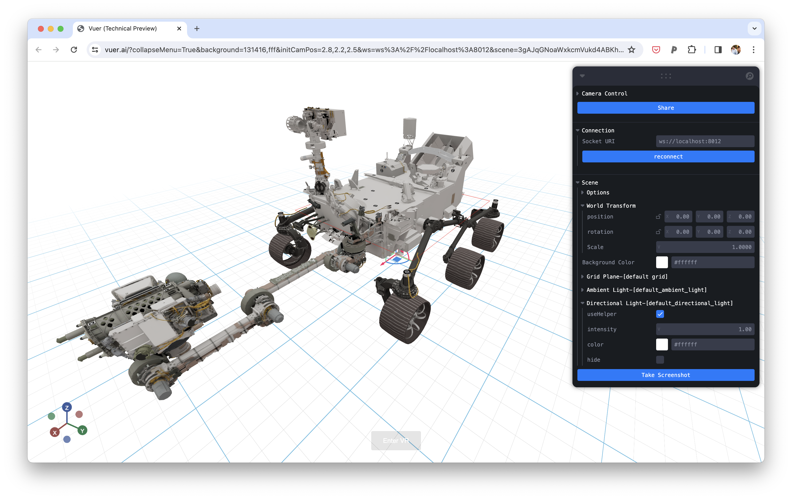

<h2>Vuer: An Event-Driven, Declarative Visualization Toolkit for GenAI and Robotics
<br/>

<a href="https://pypi.org/project/vuer/">

</a>
<a href="https://docs.vuer.ai">

</a>
</h2>
<p>
<strong><code>pip install 'vuer[all]'</code></strong>
&nbsp;&nbsp;⬝&nbsp;&nbsp;
<a href="https://docs.vuer.ai">docs</a>
&nbsp;&nbsp;⬝&nbsp;&nbsp;
<a href="#development">development</a>
</p>

Vuer is a light-weight visualization toolkit for interacting with dynamic 3D and robotics data. It is
VR and AR ready, and can be run on mobile devices.

## Installation

You can install `vuer` with `pip`:

```shell
pip install -U 'vuer[all]'
```

Here is an example that loads a URDF file and displays it in the browser. For a more comprehensive list of examples, please refer to
the [examples](https://docs.vuer.ai/en/latest/examples/01_trimesh.html) page.

```python
from vuer import Vuer, VuerSession
from vuer.schemas import DefaultScene, Urdf

app = Vuer()


@app.spawn(start=True)
async def main(session: VuerSession):
    app.set @ DefaultScene(
        Urdf("assets/urdf/robotiq.urdf"),
    )

    while True:
        await session.sleep(0.1)
```

[](https://vuer.ai?collapseMenu=True&background=131416,fff&initCamPos=2.8,2.2,2.5&ws=ws%3A%2F%2Flocalhost%3A8012&scene=3gAJqGNoaWxkcmVukd4ABKhjaGlsZHJlbpHeAAaoY2hpbGRyZW6Qo3RhZ6RVcmRmo2tleaExo3NyY9lSaHR0cHM6Ly9yYXcuZ2l0aHVidXNlcmNvbnRlbnQuY29tL25hc2EtanBsL20yMDIwLXVyZGYtbW9kZWxzL21haW4vcm92ZXIvbTIwMjAudXJkZqtqb2ludFZhbHVlc94AAKhyb3RhdGlvbpPLQAkeuGAAAAAAAKN0YWenTW92YWJsZaNrZXmhMqhwb3NpdGlvbpMAAMs%2FwzMzQAAAAKN0YWelU2NlbmWja2V5oTOidXCTAAABpGdyaWTDqHNob3dMZXZhwqtyYXdDaGlsZHJlbpLeAASoY2hpbGRyZW6Qo3RhZ6xBbWJpZW50TGlnaHSja2V5tWRlZmF1bHRfYW1iaWVudF9saWdodKlpbnRlbnNpdHkB3gAFqGNoaWxkcmVukKN0YWewRGlyZWN0aW9uYWxMaWdodKNrZXm5ZGVmYXVsdF9kaXJlY3Rpb25hbF9saWdodKlpbnRlbnNpdHkBpmhlbHBlcsOsaHRtbENoaWxkcmVukLJiYWNrZ3JvdW5kQ2hpbGRyZW6Q")

To get a quick overview of what you can do with `vuer`, check out the following:

- take a look at the example gallery [here](https://docs.vuer.ai/en/latest/examples/01_trimesh.html)
- or try to take a look at this demo with a Unitree Go1 robot in front of a flight of stairs [here](https://docs.vuer.ai/en/latest/tutorials/robotics/urdf_go1_stairs.html)

For a comprehensive list of visualization components, please refer to
the [API documentation on Components](https://docs.vuer.ai/en/latest/api/vuer.html).

For a comprehensive list of data types, please refer to the [API documentation on Data Types](https://docs.vuer.ai/en/latest/api/types.html).

Now, to run the examples, first download the example datasets.

Each subdirectory in the `assets` directory contains a `Makefile`. Run the `make` command in each subdirectory to download the datasets. For
example:

```bash
cd assets/static_3d
make
```

Then run the examples

```bash
cd vuer/examples/vuer
python 01_trimesh.py
```

## Development

### Setup

**Using uv (recommended):**
```bash
uv sync --group dev
source .venv/bin/activate
```

**Using pip:**
```bash
pip install -e '.[dev]'
```

### Common Tasks

```bash
make docs     # Build documentation
make preview  # Build and live preview at http://0.0.0.0:8000
make test     # Run tests
make clean         # Clean build artifacts
```

### Contributing

We welcome contributions! See [CONTRIBUTING.md](CONTRIBUTING.md) for detailed guidelines on:
- Setting up your development environment
- Code quality standards (ruff formatting and linting)
- Documentation workflow
- Publishing releases

## To Cite

```bibtex
@software{vuer,
  author = {Ge Yang},
  title = {{VUER}: An Event-Driven, Declarative Visualization Toolkit for GenAI and Robotics},
  version = {},
  publisher = {GitHub},
  url = {https://github.com/vuer-ai/vuer},
  year = {2025}
}
```

## About Us

Vuer is built by researchers at MIT and UCSD in fields including robotics, computer vision, and computer graphics.


