# Primitive Geometries

Primitive geometries are the building blocks of 3D scenes. Vuer provides **14** fundamental geometric shapes that can be combined, transformed, and styled to create complex visualizations.

[//]: # (<iframe src="https://vuer.ai/?hideUI=true&reconnect=True&scene=hqN0YWelU2NlbmWja2V5oTCidXCTAAEAqmJnQ2hpbGRyZW6Qq3Jhd0NoaWxkcmVulISoY2hpbGRyZW6Qo3RhZ6xBbWJpZW50TGlnaHSja2V5p2FtYmllbnSpaW50ZW5zaXR5yz%2FgAAAAAAAAhahjaGlsZHJlbpCjdGFnsERpcmVjdGlvbmFsTGlnaHSja2V5o3N1bqlpbnRlbnNpdHkBqHBvc2l0aW9ukwMDA4WoY2hpbGRyZW6Qo3RhZ7FQZXJzcGVjdGl2ZUNhbWVyYaNrZXmycGVyc3BlY3RpdmUtY2FtZXJhq21ha2VEZWZhdWx0w6hwb3NpdGlvbpP8AgSDqGNoaWxkcmVukKN0YWetT3JiaXRDb250cm9sc6NrZXmrb3JiLWNvbnRyb2yoY2hpbGRyZW6YhqhjaGlsZHJlbpCjdGFnqEN5bGluZGVyo2tleahjeWxpbmRlcqRhcmdzlMs%2F6ZmZmZmZmss%2F6ZmZmZmZmss%2F4AAAAAAAACCocG9zaXRpb26Ty8AMAAAAAAAAyz%2FQAAAAAAAA%2F6xtYXRlcmlhbFR5cGWlYmFzaWOGqGNoaWxkcmVukKN0YWemU3BoZXJlo2tleahzcGhlcmUtMaRhcmdzk8s%2F5mZmZmZmZiAgqHBvc2l0aW9uk8vADAAAAAAAAMs%2F8ZmZmZmZmv%2BsbWF0ZXJpYWxUeXBlpWJhc2ljh6hjaGlsZHJlbpCjdGFnqk9jdGFoZWRyb26ja2V5qm9jdGFoZWRyb26kYXJnc5LLP%2BzMzMzMzM0AqHBvc2l0aW9uk8u%2F%2FMzMzMzMzcs%2F%2BAAAAAAAAMs%2F0zMzMzMzM6hyb3RhdGlvbpMAAMs%2F2SbpeNT99KxtYXRlcmlhbFR5cGWlYmFzaWOHqGNoaWxkcmVukKN0YWelVG9ydXOja2V5pXRvcnVzpGFyZ3OUyz%2FgAAAAAAAAyz%2FDMzMzMzMzIECocG9zaXRpb26TAMs%2F2ZmZmZmZmss%2F6ZmZmZmZmqhyb3RhdGlvbpPLP%2Fki0OVgQYkAAKxtYXRlcmlhbFR5cGWlYmFzaWOHqGNoaWxkcmVukKN0YWejQm94o2tleaNib3ikYXJnc5PLP%2FMzMzMzMzPLP%2FMzMzMzMzPLP%2FMzMzMzMzOocG9zaXRpb26Tyz%2FZmZmZmZmayz%2FgAAAAAAAA%2Fqhyb3RhdGlvbpMAAACsbWF0ZXJpYWxUeXBlpWJhc2ljhqhjaGlsZHJlbpCjdGFnplNwaGVyZaNrZXmoc3BoZXJlLTKkYXJnc5PLP%2BTMzMzMzM0gIKhwb3NpdGlvbpPLP%2FzMzMzMzM3LP%2BZmZmZmZmYArG1hdGVyaWFsVHlwZaViYXNpY4eoY2hpbGRyZW6Qo3RhZ6VQbGFuZaNrZXmlZmxvb3KkYXJnc5IUFKhwb3NpdGlvbpMAAACocm90YXRpb26Ty7%2F5HrhR64UfAACsbWF0ZXJpYWxUeXBlp2xhbWJlcnSGqGNoaWxkcmVukKN0YWelUGxhbmWja2V5qGJhY2tkcm9wpGFyZ3OSFBSocG9zaXRpb26TAAD9rG1hdGVyaWFsVHlwZadsYW1iZXJ0" width="100%" height="400px" frameborder="0"></iframe>)

[//]: # (<details>)

[//]: # (<summary><strong>Source Code</strong></summary>)

[//]: # ()
[//]: # (```python)

[//]: # (from vuer import Vuer, VuerSession)

[//]: # (from vuer.schemas import Scene, Box, Sphere, Cylinder, Octahedron, Torus, Plane, OrbitControls)

[//]: # ()
[//]: # (app = Vuer&#40;&#41;)

[//]: # ()
[//]: # (@app.spawn&#40;start=True&#41;)

[//]: # (async def main&#40;session: VuerSession&#41;:)

[//]: # (    session.set @ Scene&#40;)

[//]: # (        Cylinder&#40;)

[//]: # (            args=[0.8, 0.8, 0.5, 32],)

[//]: # (            position=[-3.5, 0.25, -1],)

[//]: # (            materialType="basic",)

[//]: # (            key="cylinder",)

[//]: # (        &#41;,)

[//]: # ()
[//]: # (        Sphere&#40;)

[//]: # (            args=[0.7, 32, 32],)

[//]: # (            position=[-3.5, 1.1, -1],)

[//]: # (            materialType="basic",)

[//]: # (            key="sphere-1",)

[//]: # (        &#41;,)

[//]: # ()
[//]: # (        Octahedron&#40;)

[//]: # (            args=[0.9, 0],)

[//]: # (            position=[-1.8, 1.5, 0.3],)

[//]: # (            rotation=[0, 0, 0.393],)

[//]: # (            materialType="basic",)

[//]: # (            key="octahedron",)

[//]: # (        &#41;,)

[//]: # ()
[//]: # (        Torus&#40;)

[//]: # (            args=[0.5, 0.15, 32, 64],)

[//]: # (            position=[0, 0.4, 0.8],)

[//]: # (            rotation=[1.571, 0, 0],)

[//]: # (            materialType="basic",)

[//]: # (            key="torus",)

[//]: # (        &#41;,)

[//]: # ()
[//]: # (        Box&#40;)

[//]: # (            args=[1.2, 1.2, 1.2],)

[//]: # (            position=[0.4, 0.5, -2],)

[//]: # (            rotation=[0, 0, 0],)

[//]: # (            materialType="basic",)

[//]: # (            key="box",)

[//]: # (        &#41;,)

[//]: # ()
[//]: # (        Sphere&#40;)

[//]: # (            args=[0.65, 32, 32],)

[//]: # (            position=[1.8, 0.7, 0],)

[//]: # (            materialType="basic",)

[//]: # (            key="sphere-2",)

[//]: # (        &#41;,)

[//]: # ()
[//]: # (        Plane&#40;)

[//]: # (            args=[20, 20],)

[//]: # (            position=[0, 0, 0],)

[//]: # (            rotation=[-1.57, 0, 0],)

[//]: # (            materialType="lambert",)

[//]: # (            key="floor",)

[//]: # (        &#41;,)

[//]: # (        Plane&#40;)

[//]: # (            args=[20, 20],)

[//]: # (            position=[0, 0, -3],)

[//]: # (            materialType="lambert",)

[//]: # (            key="backdrop",)

[//]: # (        &#41;,)

[//]: # ()
[//]: # (        up=[0, 1, 0],)

[//]: # (        grid=False,)

[//]: # (    &#41;)

[//]: # ()
[//]: # (    await session.forever&#40;&#41;)

[//]: # (```)

[//]: # ()
[//]: # (</details>)

[//]: # (*Expanding our first scene: adding cylinder, spheres, octahedron, and torus to demonstrate different primitive shapes*)

## Shared Properties

All primitives share these properties:

```python
from vuer.schemas import Box  # or any other primitive

Box(
    # Geometry-specific parameters
    args=[...],  # Varies by shape
    
    # Transform properties
    position=[x, y, z],      # Position in 3D space
    rotation=[rx, ry, rz],   # Rotation in radians around X, Y, Z axes
    scale=[sx, sy, sz],      # Scale factors (1 = original size)
    
    # Material properties
    materialType="standard",  # "basic", "lambert", "phong", "standard", "physical"
    color="#ff0000",         # Hex color or CSS color name
    material=dict(           # Advanced material properties
        roughness=0.5,
        metalness=0.0,
        # ... see Materials guide
    ),
    
    # Interaction
    key="unique-id",         # Required for updates and events
    onClick=handler,         # Click event handler (client-side)
)
```

## Components

### Box

A rectangular box or cube shape with customizable dimensions.

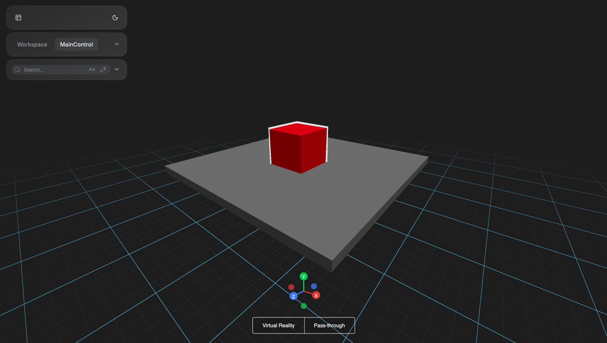

```python
args = [
    width,           # default: 1
    height,          # default: 1
    depth,           # default: 1
    widthSegments,   # default: 1
    heightSegments,  # default: 1
    depthSegments    # default: 1
]
```

```python
from vuer import Vuer, VuerSession
from vuer.schemas import Scene, Box

app = Vuer()

@app.spawn(start=True)
async def main(session: VuerSession):
    session.set @ Scene(
        # Simple cube
        Box(
            args=[1, 1, 1],
            position=[0, 0.7, 0.2],
            material=dict(color="red"),
            key="cube",
            outlines=dict(angle=0, thickness=0.005, color="white"),  # (angle, thickness, color)
        ),
        
        # Flat platform
        Box(
            args=[5, 0.2, 5],
            position=[0, 0.2, 0],
            material=dict(color="grey"),
            key="platform",
        ),
    )
    
    await session.forever()
```

### Sphere

A perfect spherical shape with customizable radius and segment resolution.

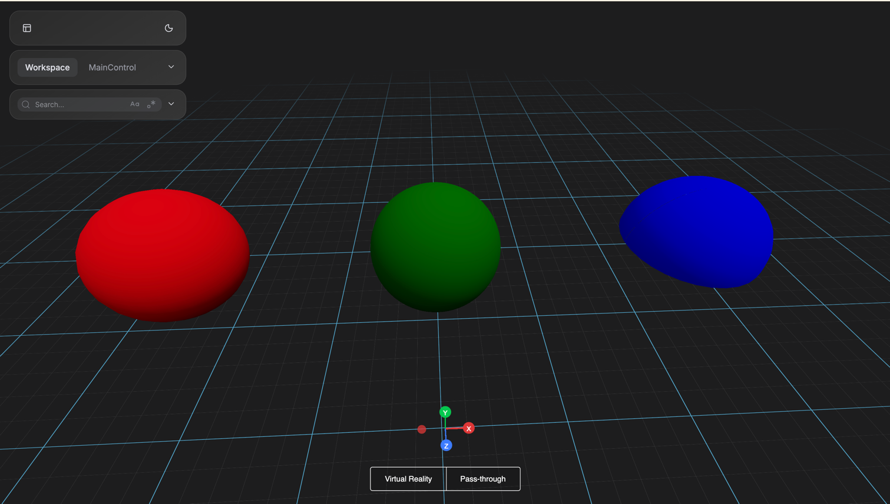

```python
args = [
    radius,          # default: 1
    widthSegments,   # default: 32 (horizontal segments)
    heightSegments,  # default: 16 (vertical segments)
    phiStart,        # default: 0 (horizontal starting angle)
    phiLength,       # default: 2π (horizontal sweep angle)
    thetaStart,      # default: 0 (vertical starting angle)
    thetaLength      # default: π (vertical sweep angle)
]
```

```python
from vuer import Vuer, VuerSession
from vuer.schemas import Scene, Sphere

app = Vuer()

@app.spawn(start=True)
async def main(session: VuerSession):
    session.set @ Scene(
        # Simple sphere
        Sphere(
            args=[0.5],  # Just radius, use defaults for segments
            position=[0, 1, 0],
            material=dict(color="red"),
            key="ball",
        ),
        # High-poly smooth sphere
        Sphere(
            args=[0.5, 64, 64],  # More segments = smoother
            position=[2, 1, 0],
            material=dict(color="green"),
            key="smooth-ball",
        ),
        # Hemisphere (half sphere)
        Sphere(
            args=[0.5, 32, 16, 0, 6.28, 0, 1.57],  # thetaLength controls how much of sphere
            position=[4, 1, 0],
            material=dict(color="blue"),
            key="hemisphere",
        )
        
    )
    
    await session.forever()
```

### Cylinder

A cylindrical tube shape with separate top and bottom radii.

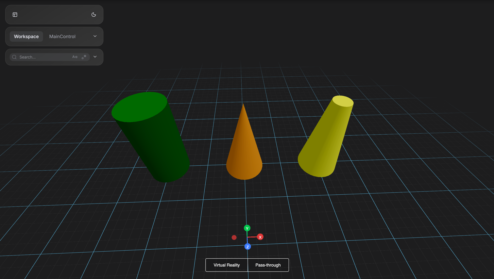

```python
args = [
    radiusTop,       # default: 1
    radiusBottom,    # default: 1
    height,          # default: 1
    radialSegments,  # default: 32
    heightSegments,  # default: 1
    openEnded,       # default: False
    thetaStart,      # default: 0
    thetaLength      # default: 2π
]
```

```python
from vuer import Vuer, VuerSession
from vuer.schemas import Scene, Cylinder

app = Vuer()

@app.spawn(start=True)
async def main(session: VuerSession):
    session.set @ Scene(
        # Standard cylinder
        Cylinder(
            args=[0.5, 0.5, 2],
            position=[0, 1, 0],
            material=dict(color="green"),
            key="pillar",
        ),
        # Cone (radiusTop=0)
        Cylinder(
            args=[0, 0.5, 2],
            position=[2, 1, 0],
            material=dict(color="orange"),
            key="cone-shape",
        ),
        # Truncated cone
        Cylinder(
            args=[0.2, 0.5, 2],
            position=[4, 1, 0],
            material=dict(color="yellow"),
            key="truncated",
        ),
    )

    await session.forever()
```

### Cone

A pointed cone shape with circular base and single apex.

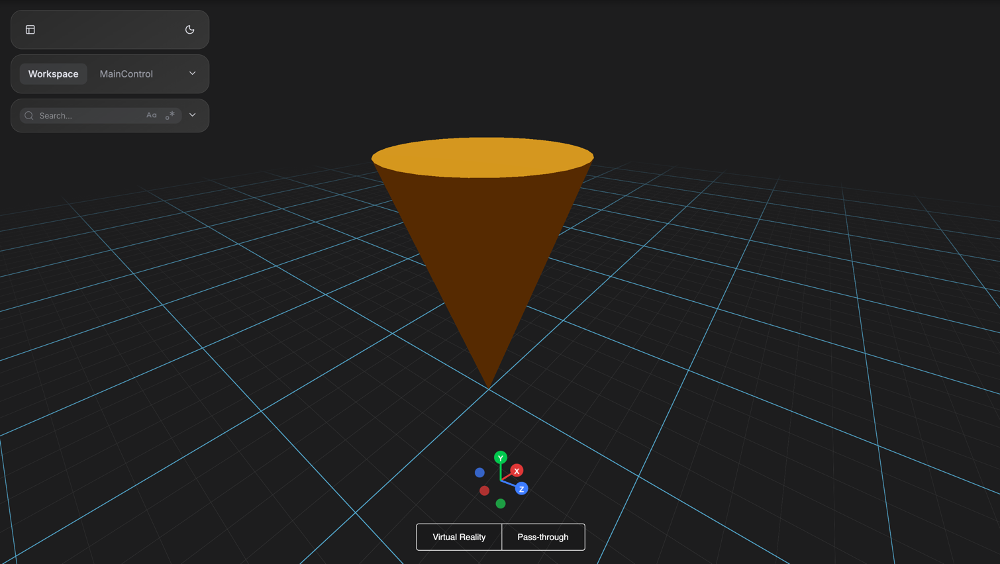

```python
args = [
    radius,          # default: 1
    height,          # default: 1
    radialSegments,  # default: 32
    heightSegments,  # default: 1
    openEnded,       # default: False
    thetaStart,      # default: 0
    thetaLength      # default: 2π
]
```

```python
from vuer import Vuer, VuerSession
from vuer.schemas import Scene, Cone

app = Vuer()

@app.spawn(start=True)
async def main(session: VuerSession):
    session.set @ Scene(
        Cone(
            args=[0.5, 1.5],
            position=[0, 0.75, 0],
            rotation=[0, 0, 3.14],  # Point downward
            material=dict(color="orange"),
            key="cone",
        ),
    )

    await session.forever()
```

### Plane

A flat rectangular surface with customizable dimensions.

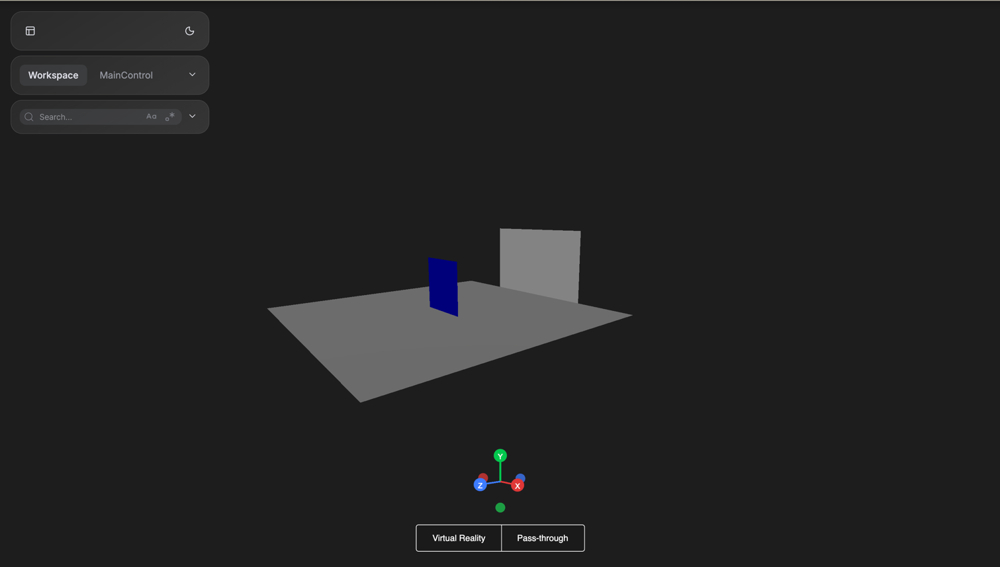

```python
args = [
    width,           # default: 1
    height,          # default: 1
    widthSegments,   # default: 1
    heightSegments   # default: 1
]
```

```python
from vuer import Vuer, VuerSession
from vuer.schemas import Scene, Plane

app = Vuer()

@app.spawn(start=True)
async def main(session: VuerSession):
    session.set @ Scene(
        # Horizontal ground
        Plane(
            args=[10, 10],
            position=[0, 0, 0],
            rotation=[-1.57, 0, 0],  # -π/2 to make horizontal
            material=dict(color="grey"),
            key="ground",
        ),
        # Vertical wall
        Plane(
            args=[5, 3],
            position=[0, 1.5, -5],
            material=dict(color="white"),
            key="wall",
        ),
        # Two-sided plane
        Plane(
            args=[2, 2],
            position=[0, 1, 0],
            material=dict(side=2, color="blue"),  # 0=front, 1=back, 2=both
            key="double-sided",
        ),
    )

    await session.forever()
```

### Circle

A flat circular disc with customizable radius and arc angle.

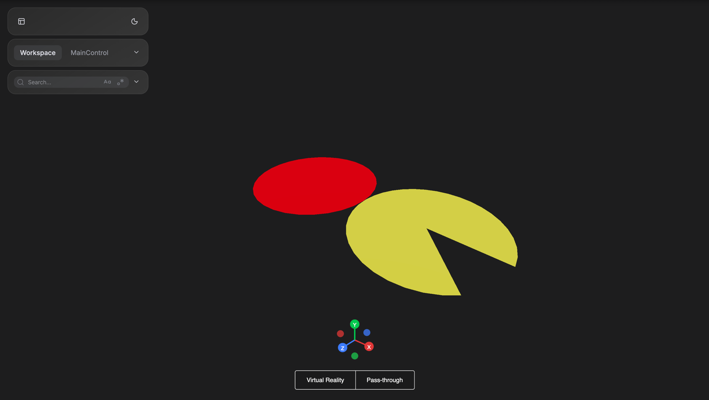

```python
args = [
    radius,          # default: 1
    segments,        # default: 32 (triangular facets)
    thetaStart,      # default: 0
    thetaLength      # default: 2π (full circle)
]
```

```python
from vuer import Vuer, VuerSession
from vuer.schemas import Scene, Circle

app = Vuer()

@app.spawn(start=True)
async def main(session: VuerSession):
    session.set @ Scene(
        # Full circle
        Circle(
            args=[1],
            position=[0, 0, 0],
            rotation=[-1.57, 0, 0],
            material=dict(color="red"),
            key="disc",
        ),
        # Pac-Man (partial circle)
        Circle(
            args=[1, 32, 0, 5.5],  # thetaLength < 2π creates pac-man
            position=[2, 0, 0],
            rotation=[-1.57, 0, 0],
            material=dict(color="yellow"),
            key="pacman",
        ),
    )

    await session.forever()
```

### Ring

A flat ring shape with hollow center (annulus).

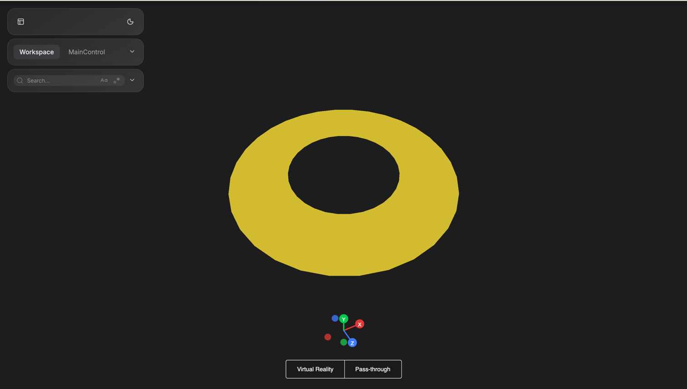

```python
args = [
    innerRadius,     # default: 0.5
    outerRadius,     # default: 1
    thetaSegments,   # default: 32
    phiSegments,     # default: 1
    thetaStart,      # default: 0
    thetaLength      # default: 2π (full ring)
]
```

```python
from vuer import Vuer, VuerSession
from vuer.schemas import Scene, Ring

app = Vuer()

@app.spawn(start=True)
async def main(session: VuerSession):
    session.set @ Scene(
        Ring(
            args=[0.5, 1],
            position=[0, 0, 0],
            rotation=[-1.57, 0, 0],
            material=dict(color="gold"),
            key="ring",
        ),
    )

    await session.forever()
```

### Capsule

A pill-shaped cylinder with rounded hemispherical ends.

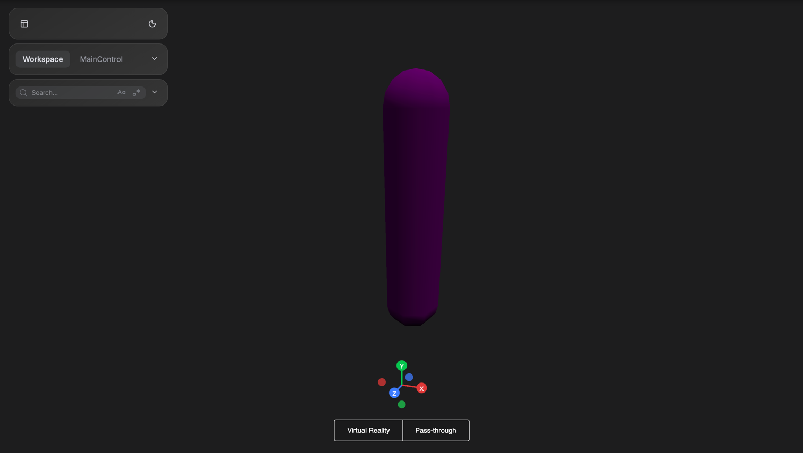

```python
args = [
    radius,          # default: 1
    length,          # default: 1 (cylindrical section length)
    capSegments,     # default: 4 (curve segments for each cap)
    radialSegments   # default: 8
]
```

```python
from vuer import Vuer, VuerSession
from vuer.schemas import Scene, Capsule

app = Vuer()

@app.spawn(start=True)
async def main(session: VuerSession):
    session.set @ Scene(
        Capsule(
            args=[0.3, 2],
            position=[0, 1, 0],
            material=dict(color="purple"),
            key="pill",
        ),
    )

    await session.forever()
```

### Torus

A 3D donut shape with customizable major and minor radii.

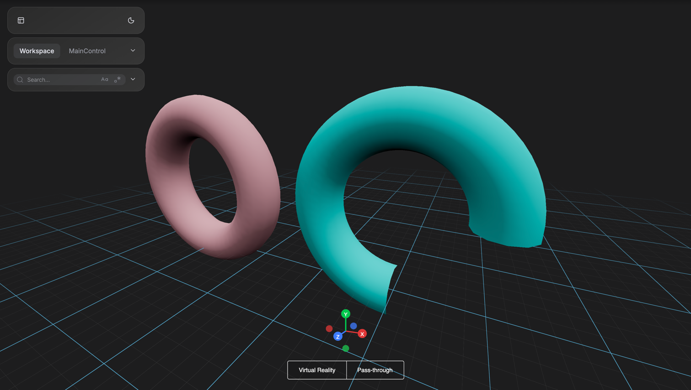

```python
args = [
    radius,          # default: 1 (torus radius)
    tube,            # default: 0.4 (tube radius)
    radialSegments,  # default: 12 (segments along tube)
    tubularSegments, # default: 48 (segments around torus)
    arc              # default: 2π (complete torus)
]
```

```python
from vuer import Vuer, VuerSession
from vuer.schemas import Scene, Torus

app = Vuer()

@app.spawn(start=True)
async def main(session: VuerSession):
    session.set @ Scene(
        # Complete torus
        Torus(
            args=[1, 0.3],
            position=[0, 1, 0],
            material=dict(color="pink"),
            key="donut",
        ),
        # Partial torus (C-shape)
        Torus(
            args=[1, 0.3, 12, 48, 4.71],  # arc < 2π creates C-shape
            position=[3, 1, 0],
            material=dict(color="cyan"),
            key="c-shape",
        ),
    )

    await session.forever()
```

### TorusKnot

An intertwined knot shape with customizable winding parameters.

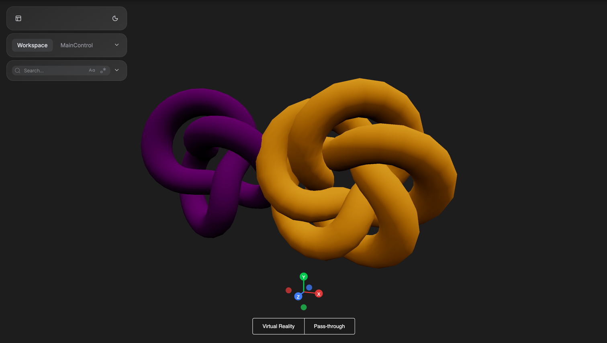

```python
args = [
    radius,          # default: 1
    tube,            # default: 0.4 (tube radius)
    tubularSegments, # default: 64
    radialSegments,  # default: 8
    p,               # default: 2 (winds around rotational axis)
    q                # default: 3 (winds around central axis)
]
```

```python
from vuer import Vuer, VuerSession
from vuer.schemas import Scene, TorusKnot

app = Vuer()

@app.spawn(start=True)
async def main(session: VuerSession):
    session.set @ Scene(
        # Trefoil knot (classic)
        TorusKnot(
            args=[1, 0.3, 100, 16, 2, 3],
            position=[0, 1, 0],
            material=dict(color="purple"),
            key="trefoil",
        ),
        # Cinquefoil knot
        TorusKnot(
            args=[1, 0.3, 100, 16, 3, 5],
            position=[3, 1, 0],
            material=dict(color="orange"),
            key="cinquefoil",
        ),
    )

    await session.forever()
```

### Tetrahedron (4 faces)

A pyramid-shaped polyhedron with four triangular faces, representing the simplest platonic solid.

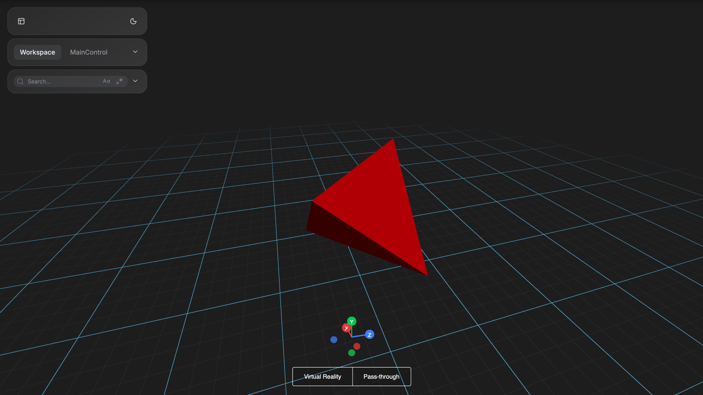

```python
args = [
    radius,          # default: 1
    detail           # default: 0 (subdivision level)
]
```

```python
from vuer import Vuer, VuerSession
from vuer.schemas import Scene, Tetrahedron

app = Vuer()

@app.spawn(start=True)
async def main(session: VuerSession):
    session.set @ Scene(
        Tetrahedron(
            args=[1],
            position=[0, 1, 0],
            material=dict(color="red"),
            key="tetra",
        ),
    )

    await session.forever()
```

### Octahedron (8 faces)

A diamond-shaped polyhedron with eight triangular faces, often used for gem-like objects.

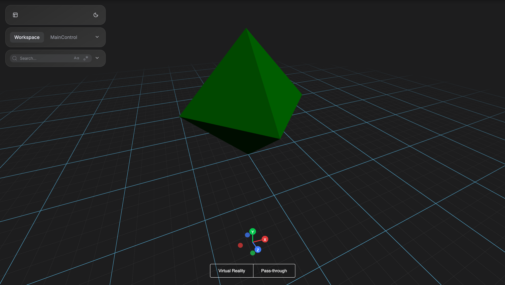

```python
args = [
    radius,          # default: 1
    detail           # default: 0 (subdivision level)
]
```

```python
from vuer import Vuer, VuerSession
from vuer.schemas import Scene, Octahedron

app = Vuer()

@app.spawn(start=True)
async def main(session: VuerSession):
    session.set @ Scene(
        Octahedron(
            args=[1],
            position=[0, 1, 0],
            material=dict(color="green"),
            key="octa",
        ),
    )

    await session.forever()
```

### Dodecahedron (12 faces)

A soccer ball-like polyhedron with twelve pentagonal faces, creating a nearly spherical shape.

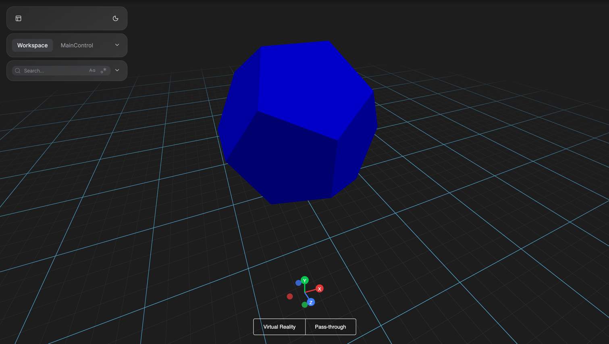

```python
args = [
    radius,          # default: 1
    detail           # default: 0 (subdivision level)
]
```

```python
from vuer import Vuer, VuerSession
from vuer.schemas import Scene, Dodecahedron

app = Vuer()

@app.spawn(start=True)
async def main(session: VuerSession):
    session.set @ Scene(
        Dodecahedron(
            args=[1],
            position=[0, 1, 0],
            material=dict(color="blue"),
            key="dodeca",
        ),
    )

    await session.forever()
```

### Icosahedron (20 faces)

A complex polyhedron with twenty triangular faces, the most sphere-like of the platonic solids.

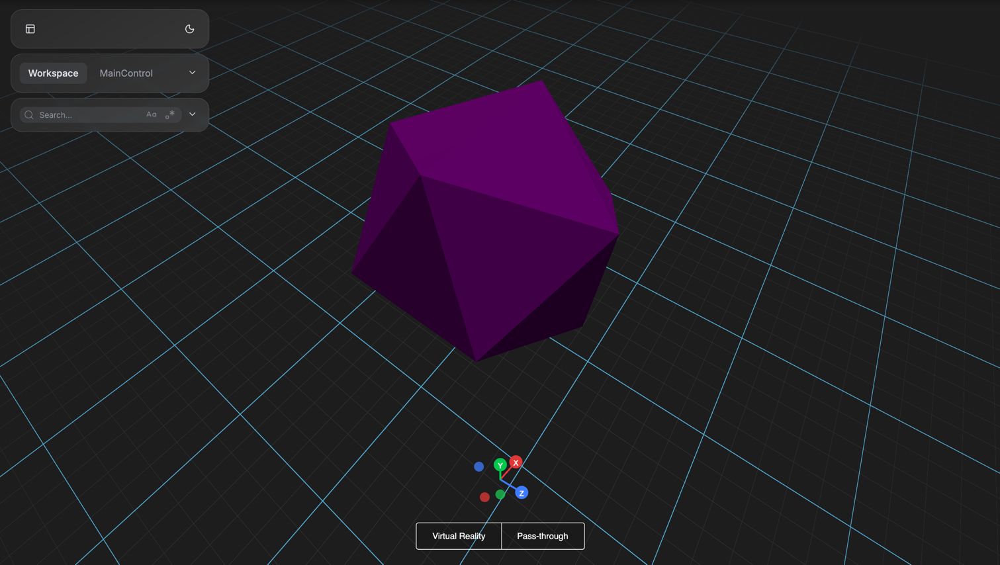

```python
args = [
    radius,          # default: 1
    detail           # default: 0 (subdivision level)
]
```

```python
from vuer import Vuer, VuerSession
from vuer.schemas import Scene, Icosahedron

app = Vuer()

@app.spawn(start=True)
async def main(session: VuerSession):
    session.set @ Scene(
        Icosahedron(
            args=[1],
            position=[0, 1, 0],
            material=dict(color="purple"),
            key="icosa",
        ),
    )

    await session.forever()
```

**Detail parameter**: Higher values subdivide faces for smoother appearance:
- `detail=0`: Sharp edges (default)
- `detail=1`: Slightly rounded
- `detail=2+`: Approaches sphere

## Tips

1. **Segment count affects performance**: Higher segments = smoother but slower
   - Use low poly (8-16 segments) for distant/small objects
   - Use high poly (32-64 segments) for close-up hero objects
2. **Box is fastest, use for prototyping**
3. **Sphere is expensive, consider Icosahedron for low-poly style**

