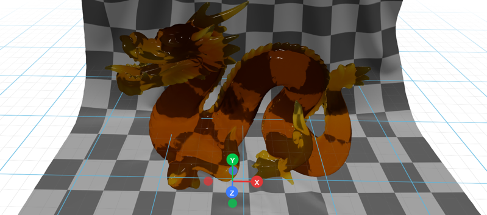

# Glb - GLB/GLTF File Loader

The `Glb` component loads 3D models from GLB (GL Transmission Format Binary) and GLTF files, the modern standard for 3D assets on the web. GLB is the binary version of GLTF, offering superior compression and faster loading than OBJ.

**Why GLB?**
- **Fast loading**: Binary format, up to 10x smaller than OBJ
- **Everything embedded**: Geometry, materials, textures in one file
- **Animation support**: Skeletal animations and morph targets
- **Industry standard**: Supported by all major 3D tools



## Basic Usage

A minimal example that loads a GLB model:

```python
import os
from vuer import Vuer
from vuer.schemas import DefaultScene, Glb, OrbitControls

app = Vuer(static_root=os.getcwd() + "/../../../assets")
glb_file = "static_3d/dragon.glb"

@app.spawn(start=True)
async def main(sess):
    sess.set @ DefaultScene(
        Glb(
            src="http://localhost:8012/static/" + glb_file,
            position=[0, 0, 0],
            key="glb-model",
        ),
        show_helper=False,
        bgChildren=[
            OrbitControls(key="OrbitControls")
        ],
    )

    await sess.forever()
```
