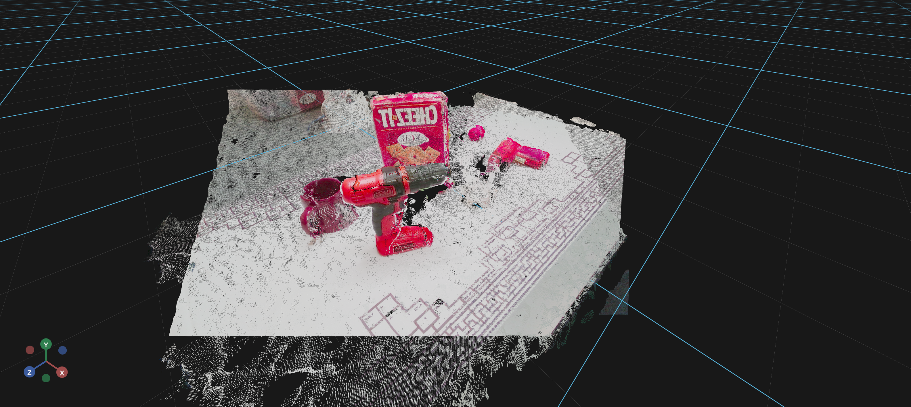

# Pcd

The `Pcd` component loads and displays PCD (Point Cloud Data) files.
This is ideal for:
- Loading 3D scan data from sensors
- Displaying point clouds from ROS or PCL pipelines
- Visualizing LiDAR captures
- Loading assets from robotics applications



## Basic Usage

A minimal example that loads a PCD file from a URL:

```python
import os
from vuer import Vuer, VuerSession
from vuer.schemas import Pcd

f3rm_ycb_1 = "pointclouds/f3rm_ycb_1.pcd"
f3rm_ycb_2 = "pointclouds/f3rm_ycb_2.pcd"

app = Vuer(static_root=os.getcwd() + "/../../../assets")

@app.spawn(start=True)
async def main(sess: VuerSession):
    sess.upsert @ Pcd(
        src="http://localhost:8012/static/" + f3rm_ycb_1,
        size=0.001,
        position=[0, 0, 0.5],
    )
    sess.upsert @ Pcd(
        src="http://localhost:8012/static/" + f3rm_ycb_2,
        size=0.001,
        position=[0, 0, 0.5],
    )

    await sess.forever()
```

## Key Parameters

| Parameter | Type | Default | Description |
|-----------|------|---------|-------------|
| `src` | str | - | URL or local file path to the PCD file |
| `text` | str | - | Text content of the PCD file (load from string) |
| `buff` | bytes | - | Binary content of the PCD file (most efficient) |
| `encoding` | str | `'ascii'` | Encoding of the PCD file |
| `size` | float | - | Size of the points in the point cloud |
| `matrix` | tuple[float, ...] | - | 4x4 transformation matrix (16 values) for positioning and orienting |
| `hide` | bool | `False` | Flag to hide the point cloud |

## Learn More

For detailed examples of using `Pcd`, see:

- [Showing Point Clouds](../examples/point_clouds/pointcloud.md) - Programmatic point cloud display
