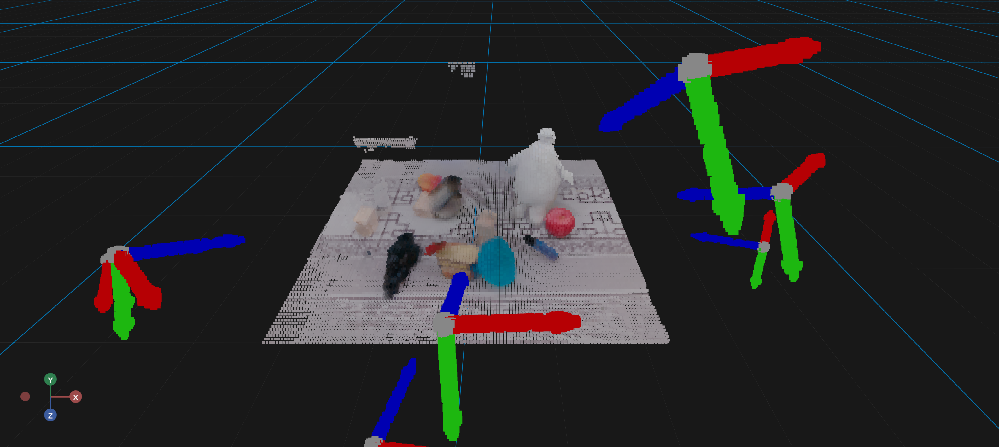

# Ply

The `Ply` component loads and displays PLY (Polygon File Format) point cloud files.
This is ideal for:
- Loading 3D scan data
- Displaying pre-processed point clouds
- Visualizing LiDAR captures
- Loading assets from 3D scanning software



```{admonition} Changing the Tone Mapping Exposure
:class: tip
Point cloud rendering does not depend on the environment lighting.

You can, however, change the toneMappingExposure to make the point cloud look nicer.
```

```{admonition} Point Clouds looking Desaturated
:class: tip
This usually happens because your realsense camera is overexposed. You need
to adjust the exposure settings on the camera to make the point cloud look 
nicer.
```


## Basic Usage

A minimal example that loads a PLY file from a URL:

```python
import os
import numpy as np
from vuer import Vuer, VuerSession
from vuer.schemas import Ply, Scene, OrbitControls

pixelnerf = "pointclouds/pixelnerf.ply"

app = Vuer(static_root=os.getcwd() + "/../../../assets")


@app.spawn(start=True)
async def main(sess: VuerSession):
    # setting the toneMappingExposure to a lower value to make the color look nicer.
    sess.set @ Scene(
        toneMappingExposure=0.4,
        bgChildren=[
            OrbitControls(key="OrbitControls")
        ],
    )

    sess.upsert @ Ply(
        src="http://localhost:8012/static/" + pixelnerf,
        size=0.008,
        rotation=[-0.5 * np.pi, 0, -0.5 * np.pi]
    )

    await sess.forever()
```

## Key Parameters

| Parameter | Type | Default | Description |
|-----------|------|---------|-------------|
| `src` | str | - | URL to the PLY file |
| `size` | float | `0.01` | Point size |
| `position` | list | `[0,0,0]` | Point cloud position |
| `rotation` | list | `[0,0,0]` | Point cloud rotation |
| `scale` | float/list | `1` | Point cloud scale |

## Learn More

For detailed examples of using `Ply`, see:

- [Showing Point Clouds](../examples/point_clouds/pointcloud.md) - Programmatic point cloud display
