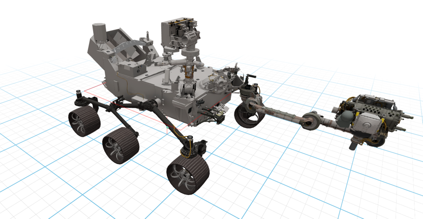

# Loading URDF

This example demonstrates how to load and display a **URDF** file directly from a URL.


## Code Example

```python
from asyncio import sleep

from vuer import Vuer
from vuer.schemas import DefaultScene, OrbitControls, Urdf

app = Vuer()

@app.spawn(start=True)
async def main(session):
    session.set @ DefaultScene(
Urdf(
            # Load URDF directly from a URL
            src="https://raw.githubusercontent.com/nasa-jpl/m2020-urdf-models/main/rover/m2020.urdf",
        ),
        up=[0, 0, -1],
        bgChildren=[
            OrbitControls(key="OrbitControls"),
        ],

    )
    while True:
        await sleep(16)
```
