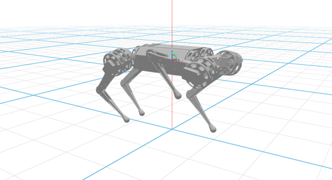

# Loading URDF from Local Files

This example shows how to load a **URDF file from your local filesystem** and animate joint values in real-time.



## Code Example

```python
import math
from asyncio import sleep
from math import pi
from pathlib import Path

from vuer import Vuer, VuerSession
from vuer.schemas import DefaultScene, Movable, OrbitControls, Urdf

# Set up static file serving from the assets directory
assets_folder = Path(__file__).parent / "../../../assets"
app = Vuer(static_root=assets_folder)

# URDF file path (served via Vuer's static file server)
urdf_path = "http://localhost:8012/static/robots/mini_cheetah/mini_cheetah.urdf"

# Initial joint configuration for the quadruped robot
initial_joints = {
    "FL_hip_joint": -0.2,
    "RL_hip_joint": -0.2,
    "FR_hip_joint": 0.2,
    "RR_hip_joint": 0.2,
    "FL_thigh_joint": -0.25 * pi,
    "RL_thigh_joint": -0.25 * pi,
    "FR_thigh_joint": -1.3,
    "RR_thigh_joint": -0.25 * pi,
    "FL_calf_joint": 0.5 * pi,
    "RL_calf_joint": 0.5 * pi,
    "FR_calf_joint": 0.6 * pi,
    "RR_calf_joint": 0.5 * pi,
}

@app.spawn(start=True)
async def main(session: VuerSession):
    # Set up the initial scene with the robot
    session.set @ DefaultScene(
        Movable(
            Urdf(
                src=urdf_path,
                jointValues=initial_joints,
                key="robot",
            ),
            position=[0, 0, 0.3],
            scale=0.4,
        ),
        grid=True,
        up=[0, 0, 1],
        bgChildren=[
            OrbitControls(key="OrbitControls"),
        ],
    )

    await sleep(0.1)

    # Animate the front-right leg using sinusoidal motion
    i = 0
    while True:
        # Create animated joint values by modifying FR leg
        animated_joints = initial_joints.copy()
        animated_joints["FR_thigh_joint"] = 0.5 * math.sin(i * 0.1) - 1.3
        animated_joints["FR_calf_joint"] = -0.5 * math.sin(i * 0.1) + 0.6 * pi

        # Update the robot with new joint values
        session.update @ Urdf(
            src=urdf_path,
            jointValues=animated_joints,
            key="robot",
        )

        await sleep(0.016)  # ~60 FPS
        i += 1
```
