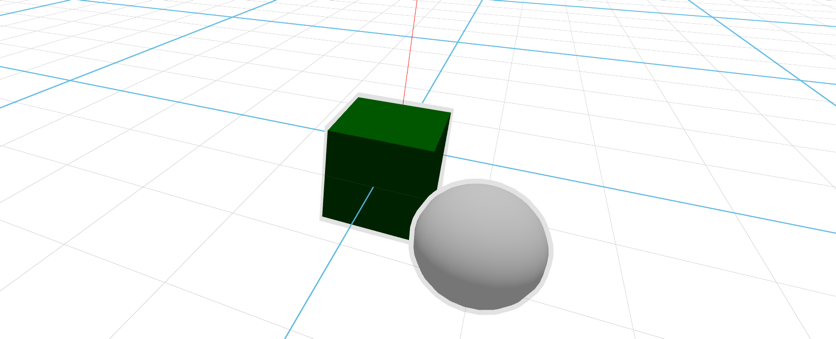

# Imperative API

This example demonstrates Vuer's **imperative API** for dynamically manipulating 3D scenes. Unlike declarative approaches where you define the entire scene upfront, the imperative API lets you add, update, and remove objects on-the-fly.



### Session Operations

| Operation | Syntax | Description |
|-----------|--------|-------------|
| `set` | `sess.set @ Component(...)` | Replace the entire scene |
| `add` | `sess.add @ Component(...)` | Add a new object to the scene |
| `update` | `sess.update @ Component(key=...)` | Update an existing object by key |
| `remove` | `sess.remove @ Component(key=...)` | Remove an object by key |

```{admonition} Key Requirement
:class: warning
When using `update` or `remove`, objects **must have a unique `key`** so Vuer knows which object to modify.
```

## Code Example

```python
from asyncio import sleep

from vuer import Vuer, VuerSession
from vuer.schemas import (
    Box,
    Sphere,
    DefaultScene,
    OrbitControls
)

app = Vuer(
    queries=dict(
        reconnect=True,
        grid=False,
        backgroundColor="black",
    ),
)

@app.spawn(start=True)
async def show_heatmap(sess: VuerSession):
    sess.set @ DefaultScene(
        bgChildren=[
            OrbitControls(key="OrbitControls"),
        ],
    )

    sess.add @ Box(
        key="box",
        args=[0.2, 0.2, 0.2],
        position=[0, 0, 0.1],
        rotation=[0, 0, 0],
        materialType="phong",
        material=dict(color="green"),
        outlines=dict(angle=0, thickness=0.005, color="white"),
    )

    sess.add @ Sphere(
        key="sphere",
        args=[0.1, 200, 200],
        position=[0.2, 0, 0.1],
        rotation=[0, 0, 0],
        materialType="standard",
        outlines=dict(angle=0, thickness=0.002, color="white"),
    ),

    i = 0
    while True:
        i += 1
        h = 0.25 - (0.00866 * (i % 120 - 60)) ** 2
        position = [0.2, 0, 0.1 + h]
        # phase = 2 * np.pi * i / 240
        # position = [0.15 + 0.25 * np.sin(phase), 0.1, 0.2 * np.cos(phase)]
        (
            sess.update
            @ Sphere(
                key="sphere",
                args=[0.1, 20, 20],
                position=position,
                rotation=[0, 0, 0],
                materialType="standard",
            ),
        )
        await sleep(0.014)
```
