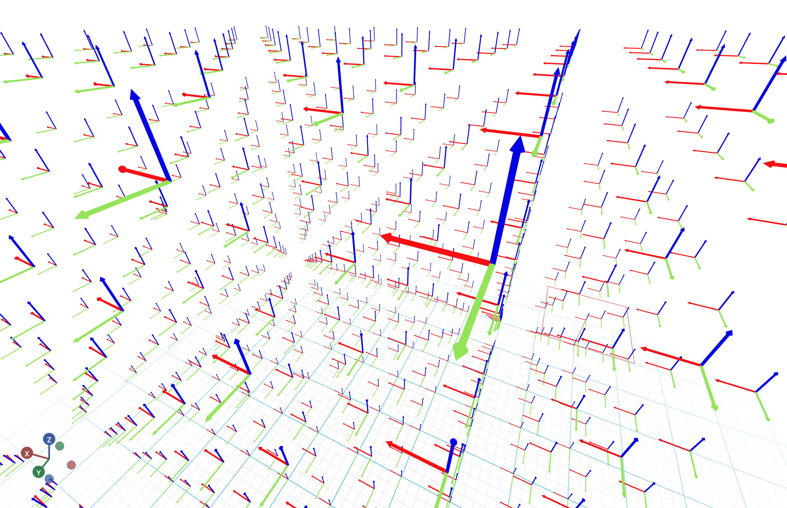

# Coordinates Markers

This example visualizes a large number of coordinates markers.




```python
from asyncio import sleep

from vuer import Vuer, VuerSession
from vuer.schemas import DefaultScene, CoordsMarker, OrbitControls

app = Vuer()

n = 10
N = 1000

markers = [
    CoordsMarker(
        position=[i % n, (i // n) % n, (i // n**2) % n],
        scale=0.25,
    )
    for i in range(N)
]

@app.spawn(start=True)
async def main(proxy: VuerSession):
    proxy.set @ DefaultScene(
        *markers,
        bgChildren=[
            OrbitControls(key="OrbitControls")
        ],
    )

    i = 0
    while True:
        i += 1
        await sleep(16)
```
