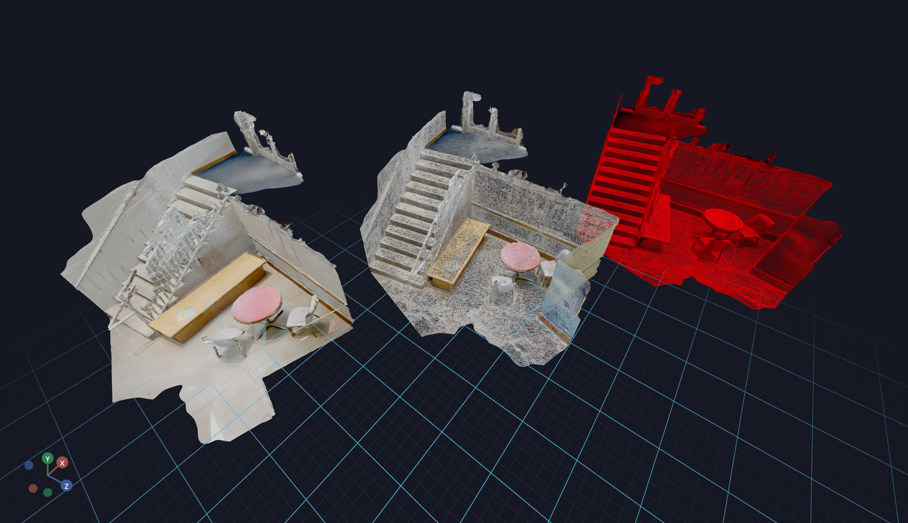

# Plane Primitive



This example shows you how to construct a plane and have it visible on both sides.

We pass in `Plane.material.side=2` to the `Plane` constructor to make it visible on both sides.

```shell
mkdir -p assets
wget https://github.com/vuer-ai/assets/raw/main/file_loaders/stairs_v1/textured.obj?download= -O assets/textured.obj
wget https://github.com/vuer-ai/assets/raw/main/file_loaders/stairs_v1/textured.mtl?download= -O assets/textured.mtl
wget https://github.com/vuer-ai/assets/raw/main/file_loaders/stairs_v1/textured_0_YV3hq55a.jpg?download= -O assets/textured_0_YV3hq55a.jpg
```

This should produce the following file tree:
```
assets
├── textured.mtl
├── textured.obj
└── textured_0_YV3hq55a.jpg

1 directory, 3 files
```

Now, run

```python
from asyncio import sleep

from vuer import Vuer
from vuer.events import Set
from vuer.schemas import DefaultScene, Obj

app = Vuer(static_root=f"{Path(__file__).parent}/assets")

# use `start=True` to start the app immediately
@app.spawn(start=True)
async def main(session):
    session.set @ DefaultScene(
        Obj(
            src="http://localhost:8012/static/textured.obj",
            mtl="http://localhost:8012/static/textured.mtl",
            position=[-4.5, 1.5, -3.5],
        ),
        up=[0, 1, 0],
    )

    session.add @ Obj(
        src="http://localhost:8012/static/textured.obj",
        mtl="http://localhost:8012/static/textured.mtl",
        wireframe=True,
        position=[0, 1.5, 0],
    )

    session.add @ Obj(
        src="http://localhost:8012/static/textured.obj",
        mtl="http://localhost:8012/static/textured.mtl",
        wireframe=True,
        color="#ff0000",
        position=[4.5, 1.5, 3.5],
    )

    while True:
        await sleep(1.0)
```


Optionally you can omit the material (`mtl`) file. In that case only the mesh will be loaded.


