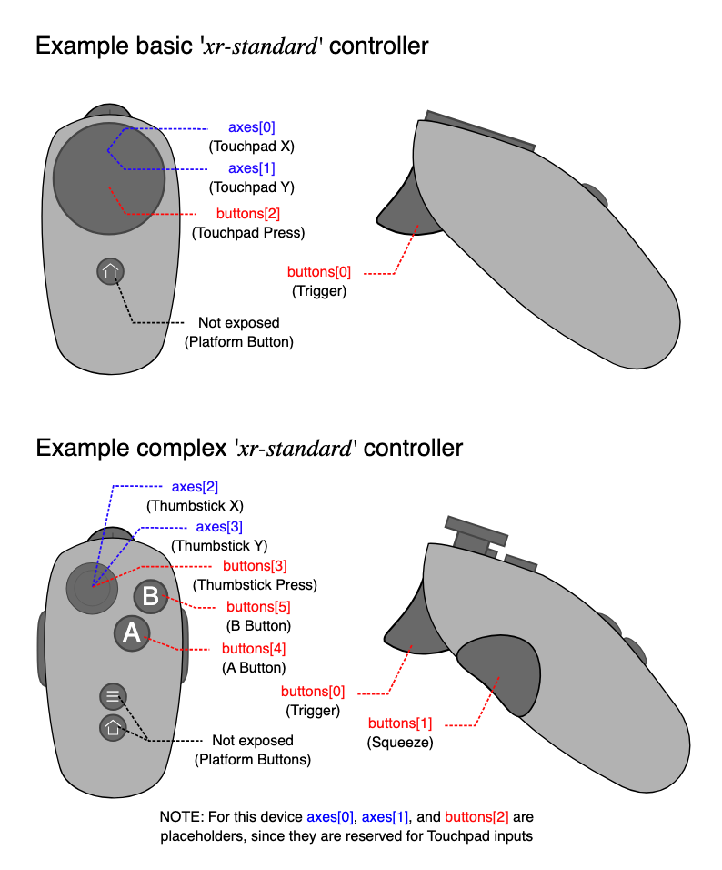

# Quest 3 Motion Controller States

The MotionController offers a way to stream the current pose,
button and trackpad states of the Quest 3 motion controller to
the python side.  To use this mixed reality (XR) feature, you
need to setup vuer behind a SSL proxy. I usually use
[ngrok](https://ngrok.com/), which is a paid service. You can also
use [local tunnel](https://localtunnel.me/), which is free.

```{admonition} Warning
:class: warning
Please go through the relevant documentation of either ngrok
or localtunnel before preceding.
- **ngrok documentation:** [https://ngrok.com/docs](https://ngrok.com/docs)
- **local tunnel documentation:** [https://localtunnel.me](https://localtunnel.me)
```

## Motion Controller API

You can get the full pose of the motion controllers by listening to the `CONTROLLER_MOVE` event.
You can add flags `left` and `right` to specify which side you want to track.


```{admonition} Warning
:class: warning
Make sure that you set the `stream` option to `True` to start streaming the 
controller movement! Otherwise the event will not be triggered. This is to avoid
unnecessary clogging up the uplink from the client.
```

```python
from vuer import Vuer, VuerSession
from vuer.schemas import MotionControllers
from asyncio import sleep

app = Vuer()

prev_bstate = None

@app.add_handler("CONTROLLER_MOVE")
async def handler(
    event,
    session: VuerSession,
):
    global prev_bstate
    bstate = event.value["leftState"]["triggerValue"]

    if prev_bstate != bstate and bstate:
        # pulse the gamepad according to the trigger value
        session.upsert @ MotionControllers(
            key="motion-controller",
            left=True,
            right=True,
            pulseLeftStrength=bstate,
            pulseLeftDuration=100,
            puseLeftHash=f"{datetime.now()}:0.3f",
        )

    prev_bstate = bstate

@app.spawn(start=True)
async def main(session: VuerSession):
    # Important: You need to set the `stream` option to `True` to start
    # streaming the controller movement.
    session.upsert @ MotionControllers(stream=True, key="motion-controller", left=True, right=True)

    while True:
        await sleep(1)
```


The returned data looks like the following:

```typescript
/**
 * Significantly more accurate and stable than controller-tracking.
 */
export type ControllerData = {
  left?:       Matrix4Tuple;      // array with length==16
  right?:      Matrix4Tuple;      // array with length==16
  leftState?:  ControllerStateType;
  rightState?: ControllerStateType;
};

export type ControllerStateType = {
  trigger:    boolean;
  squeeze:    boolean;
  touchpad:   boolean;
  thumbstick: boolean;
  aButton:    boolean;
  bButton:    boolean;

  triggerValue:      number;
  squeezeValue:      number;
  touchpadValue:   [ number, number ];   // X and Y values for the touchpad
  thumbstickValue: [ number, number ]; // X and Y values for the thumbstick
  aButtonValue:      boolean;
  bButtonValue:      boolean;
};
```

### Button and Trackpad States

The webXR Motion Controller API uses the [XRInputSource's gamepad](https://developer.mozilla.org/en-US/docs/Web/API/XRInputSource/gamepad).

For detailed API, refer to the [link](https://immersive-web.github.io/webxr-gamepads-module/#dom-xrinputsource-gamepad)

attribute to get the button and trackpad states. The following code snippet shows how to extract the button and trackpad states from the gamepad:

```{admonition} Warning
I plan to add a more event driven API for this in the future to make it easier to 
register press events.
```



| Buttons    | `xr-standard` Mapping                                        | Required |
| ---------- | ------------------------------------------------------------ | -------- |
| buttons[0] | [Primary trigger](https://immersive-web.github.io/webxr-gamepads-module/#primary-trigger) | Yes      |
| buttons[1] | [Primary squeeze button](https://immersive-web.github.io/webxr-gamepads-module/#primary-squeeze-button) | No       |
| buttons[2] | Primary touchpad                                             | No       |
| buttons[3] | Primary thumbstick                                           | No       |

| Axes    | `xr-standard` Mapping | Required |
| ------- | --------------------- | -------- |
| axes[0] | Primary touchpad X    | No       |
| axes[1] | Primary touchpad Y    | No       |
| axes[2] | Primary thumbstick X  | No       |
| axes[3] | Primary thumbstick Y  | No       |

```typescript
  const gamepad = inputSource.gamepad;
  const buttons = gamepad?.buttons || [];

  return {
    transform: Array.from(transform) as Matrix4Tuple,
    trigger: buttons[0]?.pressed  || false,
    squeeze: buttons[1]?.pressed  || false,
    touchpad: buttons[2]?.pressed || false,
    thumbstick: buttons[3]?.pressed || false,
    aButton: buttons[4]?.pressed || false,
    bButton: buttons[5]?.pressed || false,

    triggerValue: buttons[0]?.value || 0,
    squeezeValue: buttons[1]?.value || 0,
    touchpadValue: [gamepad?.axes[0] || 0, gamepad?.axes[1] || 0],
    thumbstickValue: [gamepad?.axes[2] || 0, gamepad?.axes[3] || 0],
    aButtonValue: buttons[4]?.pressed || false,
    bButtonValue: buttons[5]?.pressed || false,
  };
```

### Matrix format

All 4x4 transform matrices used in WebGL are stored in 16-element `Float32Arrays`.
The values are stored in the array in column-major order; that is, each column is
written into the array top-down before moving to the next column to the right and
writing it into the array. Therefore, for the array `[a0, a1, a2, …, a13, a14, a15]`, 
the matrix looks like this:

```
                                  ⌈  a0 a4 a8 a12  ⌉
                                  |  a1 a5 a9 a13  |
                                  |  a2 a6 a10 a14 |
                                  ⌊  a3 a7 a11 a15 ⌋
```

For details, refer to the MDN documentation on [XR Rigid Body Transformation](https://developer.mozilla.org/en-US/docs/Web/API/XRRigidTransform/matrix)

