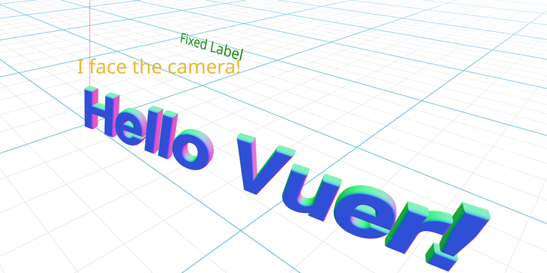

# 3D Text, 2D Text, and Billboard in Vuer

This example demonstrates how to create and customize text in Vuer:

- **Text3D**: 3D text using Three.js's TextGeometry for titles or decorative text.
- **Text**: 2D text in the 3D world for fixed labels and annotations.
- **Billboard**: Wrapper that ensures its children always face the camera.



<iframe src="https://vuer.ai/?background=131416,fff&collapseMenu=true&scene=3gAHqGNoaWxkcmVuld4ADahjaGlsZHJlbpKrSGVsbG8gVnVlciHeAAKjdGFnsm1lc2hOb3JtYWxNYXRlcmlhbKNrZXmiNDGjdGFnplRleHQzRKNrZXmnd2VsY29tZaRmb2502UBodHRwczovL3RocmVlanMub3JnL2V4YW1wbGVzL2ZvbnRzL2hlbHZldGlrZXJfYm9sZC50eXBlZmFjZS5qc29upnNtb290aMCqbGluZUhlaWdodACtbGV0dGVyU3BhY2luZ8u%2FmZmZoAAAAKxiZXZlbEVuYWJsZWTDqWJldmVsU2l6Zcs%2FpHrhQAAAAK5iZXZlbFRoaWNrbmVzc8s%2FuZmZoAAAAKRzaXplyz%2F4AAAAAAAApWNvbG9yo3JlZKVzY2FsZcs%2FwzMzQAAAAN4ABqhjaGlsZHJlbpGqRml4ZWQgVGV4dKN0YWekVGV4dKNrZXmqZml4ZWQtdGV4dKVjb2xvcqVncmVlbqhmb250U2l6Zcs%2FuZmZoAAAAKhwb3NpdGlvbpMAyz%2FTMzNAAAAA%2F94AB6hjaGlsZHJlbpHeAAeoY2hpbGRyZW6RrkJpbGxib2FyZCBUZXh0o3RhZ6RUZXh0o2tlea5iaWxsYm9hcmQtdGV4dKVjb2xvcqNyZWSoZm9udFNpemXLP7mZmaAAAAClc2NhbGXLP%2BAAAAAAAACocG9zaXRpb26Tyz%2FTMzNAAAAAyz%2FpmZmgAAAAAKN0YWepQmlsbGJvYXJko2tleaI0MqZmb2xsb3fDpWxvY2tYwqVsb2NrWcKlbG9ja1rC3gAEqGNoaWxkcmVukKN0YWesQW1iaWVudExpZ2h0o2tlea1hbWJpZW50X2xpZ2h0qWludGVuc2l0eQLeAAWoY2hpbGRyZW6Qo3RhZ7BEaXJlY3Rpb25hbExpZ2h0o2tlebFkaXJlY3Rpb25hbF9saWdodKlpbnRlbnNpdHkBqHBvc2l0aW9ukwECAqN0YWelU2NlbmWja2V5ojQ1onVwkwABAKtyYXdDaGlsZHJlbpLeAASoY2hpbGRyZW6Qo3RhZ6xBbWJpZW50TGlnaHSja2V5tWRlZmF1bHRfYW1iaWVudF9saWdodKlpbnRlbnNpdHnLP%2BAAAAAAAADeAAWoY2hpbGRyZW6Qo3RhZ7BEaXJlY3Rpb25hbExpZ2h0o2tleblkZWZhdWx0X2RpcmVjdGlvbmFsX2xpZ2h0qWludGVuc2l0eQGmaGVscGVyw6xodG1sQ2hpbGRyZW6QqmJnQ2hpbGRyZW6T3gADqGNoaWxkcmVukKN0YWeqR3JhYlJlbmRlcqNrZXmnREVGQVVMVN4AA6hjaGlsZHJlbpCjdGFnr1BvaW50ZXJDb250cm9sc6NrZXmiNDPeAAOoY2hpbGRyZW6Qo3RhZ6RHcmlko2tleaI0NA%3D%3D" width="100%" height="400px" frameborder="0"></iframe>


```python
from asyncio import sleep
from vuer import Vuer
from vuer.schemas import (
    Text3D,
    Text,
    Billboard,
    DefaultScene,
    AmbientLight,
    DirectionalLight,
    MeshNormalMaterial,
    OrbitControls,
)

# Font URL for 3D text (Three.js typeface format)
FONT_URL = "https://threejs.org/examples/fonts/helvetiker_bold.typeface.json"

app = Vuer()

@app.spawn(start=True)
async def main(session):
    # Set up the initial scene with all text components
    session.set @ DefaultScene(
        # 3D Text with bevel effect
        Text3D(
            "Hello Vuer!",
            MeshNormalMaterial(),
            key="title",
            font=FONT_URL,
            size=1.5,
            scale=0.15,
            bevelEnabled=True,
            bevelSize=0.04,
            bevelThickness=0.1,
            letterSpacing=-0.025,
        ),
        # Fixed 2D text label
        Text(
            "Fixed Label",
            key="label",
            color="green",
            fontSize=0.1,
            position=[0, 0.3, -1],
        ),
        # Billboard text that always faces the camera
        Billboard(
            Text(
                "I face the camera!",
                key="billboard-text",
                color="orange",
                fontSize=0.08,
            ),
            key="billboard",
            position=[0.5, 0.5, 0],
        ),
        # Lighting
        AmbientLight(intensity=2),
        DirectionalLight(intensity=1, position=[1, 2, 2]),
        bgChildren=[
            OrbitControls(key="OrbitControls")
        ],
    )

    # Animate the 3D text rotation
    angle = 0.0
    while True:
        angle += 0.02
        session.upsert @ Text3D(
            "Hello Vuer!",
            MeshNormalMaterial(),
            key="title",
            font=FONT_URL,
            size=1.5,
            scale=0.15,
            bevelEnabled=True,
            bevelSize=0.04,
            bevelThickness=0.1,
            letterSpacing=-0.025,
            rotation=[0, angle, 0],
        )
        await sleep(0.033)  # ~30 FPS
```

## Component Reference

| Component | Purpose | Key Parameters |
|-----------|---------|----------------|
| `Text3D` | 3D extruded text | `font`, `size`, `bevelEnabled`, `bevelSize`, `bevelThickness` |
| `Text` | 2D text in 3D space | `fontSize`, `color`, `position` |
| `Billboard` | Always faces camera | `position` (wraps child components) |

### Text3D

Renders extruded 3D text using Three.js TextGeometry. Requires a font in typeface.json format.

```python
Text3D(
    "Hello!",
    MeshNormalMaterial(),  # or any material
    font="https://threejs.org/examples/fonts/helvetiker_bold.typeface.json",
    size=1.5,              # base text size
    scale=0.15,            # overall scale
    bevelEnabled=True,     # rounded edges
    rotation=[0, 0.5, 0],  # animate rotation
)
```

### Text

2D text rendered in 3D space. Good for labels and HUD elements.

```python
Text("Label", color="green", fontSize=0.1, position=[0, 1, 0])
```

### Billboard

Wraps children so they always face the camera. Useful for labels that should be readable from any angle.

```python
Billboard(
    Text("Always visible!", color="orange", fontSize=0.08),
    position=[1, 1, 0],
)
```

## Resources

- [drei Text3D](https://drei.docs.pmnd.rs/abstractions/text3d)
- [drei Text](https://drei.docs.pmnd.rs/abstractions/text)
- [drei Billboard](https://drei.docs.pmnd.rs/abstractions/billboard)
- [Font converter](https://gero3.github.io/facetype.js/)
