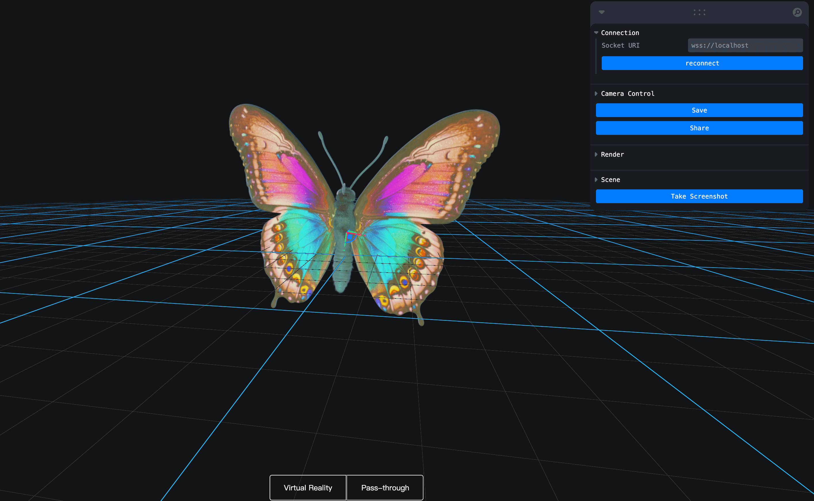

# SplatMesh in Vuer

This example demonstrates how to display SplatMesh in Vuer using the SparkSplats component.



> There is a known issue where the rendered result always lags one frame behind when displaying a model in the scene. 
> The correct rendering only appears after manually moving the camera. We will investigate the root cause of this issue later.


```python
from asyncio import sleep

from vuer import Vuer, VuerSession
from vuer.events import Set, ClientEvent
from vuer.schemas import DefaultScene, Obj, SparkSplats

app = Vuer(static_root=f"{Path(__file__).parent}/assets")

# use `start=True` to start the app immediately
@app.spawn(start=True)
async def main(session: VuerSession):

    session.upsert(
        SparkSplats(
            key="spark-splats",
            src="http://localhost:8012/static/butterfly.spz",
            position=[0, 0.5, 0],
        ),
    )

    while True:
        await sleep(1)
```
