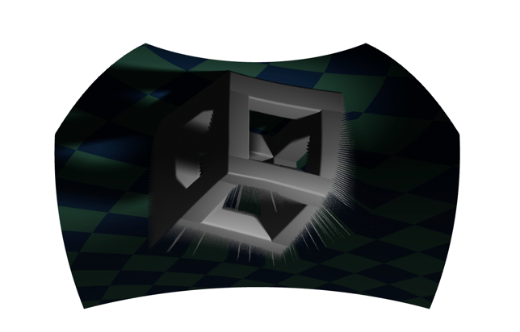

# RGB-D Visualization
Demo for rendering an RGB and Depth pair. 




```python
from pathlib import Path

from vuer import Vuer, VuerSession
from vuer.schemas import DefaultScene, ImageBackground, OrbitControls

assets_folder = Path(__file__).parent / "../../../../assets"

app = Vuer(
    queries=dict(
        reconnect=True,
        grid=False,
        backgroundColor="black",
    ),
    static_root=assets_folder,
)

def get_buffer(file_path):
    with open(file_path, "rb") as f:
        file_buffer = f.read()

    return file_buffer

@app.spawn(start=True)
async def show_heatmap(sess: VuerSession):
    rgb = get_buffer(assets_folder / "images/cubic_rgb.jpg")
    depth = get_buffer(assets_folder / "images/cubic_depth.jpg")

    sess.set @ DefaultScene(
        bgChildren=[
            ImageBackground(
                src=rgb,
                depthSrc=depth,
                distanceToCamera=1.0,
                key="background",
                fixed=True,
            ),
            OrbitControls(key="OrbitControls")

        ],
        # hide the helper to only render the objects.
        up=[0, 1, 0],
        grid=False,
        show_helper=False,

    )

    await sess.forever()
```
