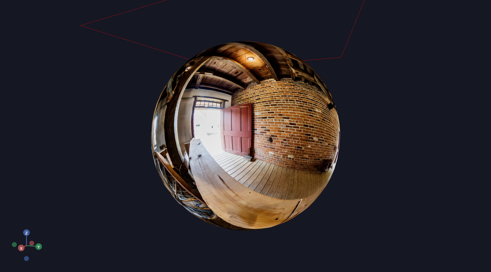
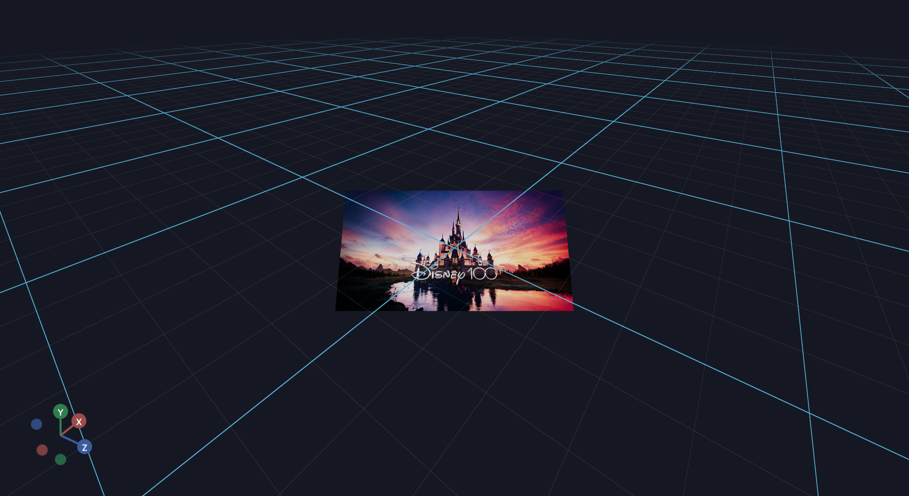

# Background & Environment

This section covers background images, video streaming, panoramic views, and HUD displays.

## RGB-D Visualization

Render RGB and depth image pairs using the `ImageBackground` component.

**[View full example →](background/depth_image.md)**


## 360 Image

Create immersive 360-degree panoramic views by mapping equirectangular images to a textured sphere, allowing viewers to explore the full panorama with orbit controls.

**[View full example →](background/sky_ball.md)**



## Heads Up Display

Display a heads-up-display (HUD) in VR using `ImageBackground` for real-time video streaming. Useful for teleoperating robots with a single camera view.

**[View full example →](background/vr_hud.md)**



## Example List

```{eval-rst}
.. toctree::
    :maxdepth: 1

    RGB-D Visualization <background/depth_image.md>
    360 Image <background/sky_ball.md>
    Heads Up Display <background/vr_hud.md>
```
