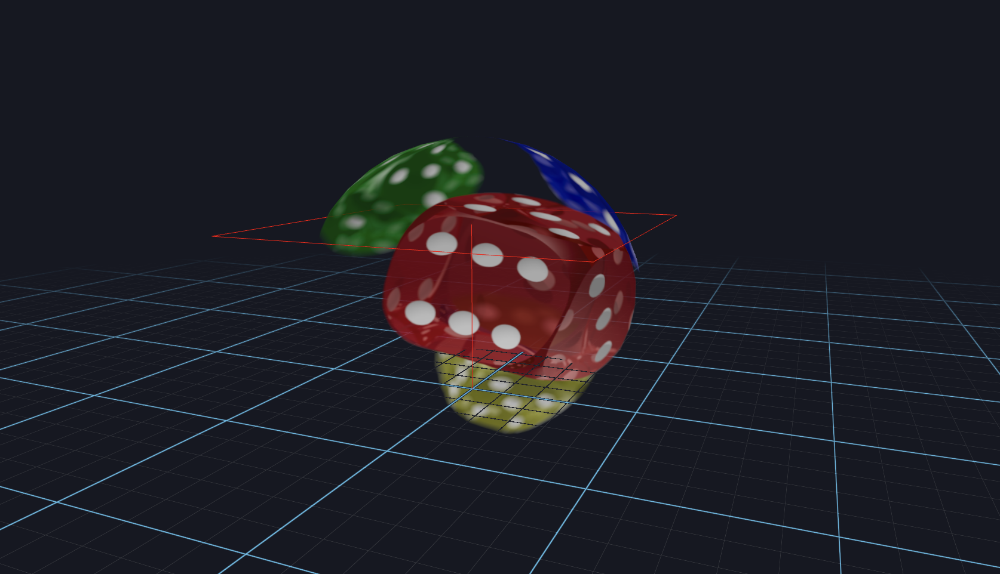
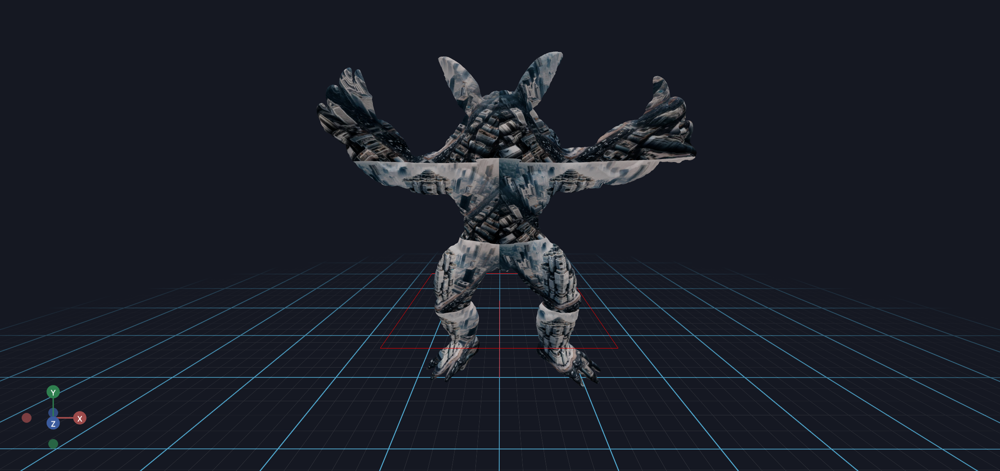

# Showing 360 Images via A Textured Sphere

This example shows you how to load mesh files in various ways, and how to update the mesh in real-time.

It should look like this, with the texture facing in-ward. We usually use this setup to render a 360 skyball.


```python
from asyncio import sleep

from vuer import Vuer
from vuer.events import Set
from vuer.schemas import DefaultScene, Sphere


app = Vuer()

# use `start=True` to start the app immediately
@app.spawn(start=True)
async def main(session):
    session @ Set(
        DefaultScene(
            # SceneBackground(),
            Sphere(
                key="ball",
                args=[1, 20, 20],
                position=[0, 0.5, 0],
                materialType="standard",
                material=dict(
                    map="https://upload.wikimedia.org/wikipedia/commons/4/47/PNG_transparency_demonstration_1.png",
                    transparent=True,
                    side=1,
                ),
            ),
            up=[0, 1, 0],
        ),
    )

    while True:
        await sleep(0.016)
```

Now, by passing in a repeat parameter, you can repeat the texture on the mesh.

add `mapRepeat=[2, 4]` to the `material` dict to repeat the texture map:

```python
TriMesh(
    key="trimesh",
    ...
    uv=uv,
    material=dict(
        map="https://upload.wikimedia.org/wikipedia/commons/4/47/PNG_transparency_demonstration_1.png",
        mapRepeat=[2, 4],
    ),
),
```


