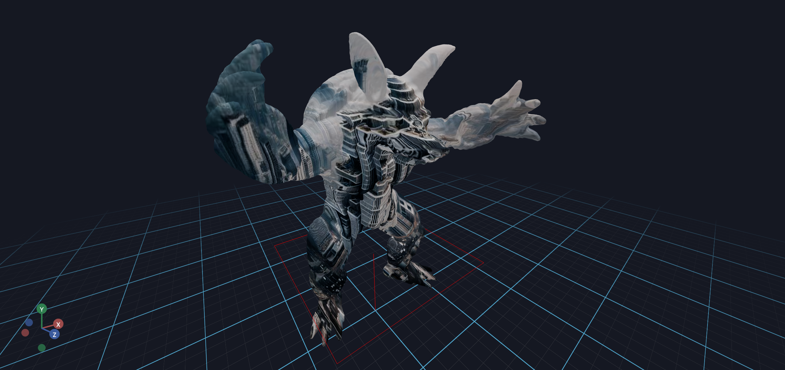

# Meshes

This section covers loading and displaying 3D mesh files in Vuer.

## Loading 3D Mesh

Learn **4 different methods** to load and display mesh files (with real-time mesh animation and wireframe rendering).

**[View full example →](meshes/mesh_loading.md)**


## Textured Trimesh

Apply image textures to your meshes using UV mapping. This example shows how to generate UV coordinates from vertex positions and control texture appearance with repeat parameters.

**[View full example →](meshes/textured_trimesh.md)**



## Example List

```{eval-rst}
.. toctree::
    :maxdepth: 1

    Loading 3D Mesh <meshes/mesh_loading.md>
    Textured Trimesh <meshes/textured_trimesh.md>
```
