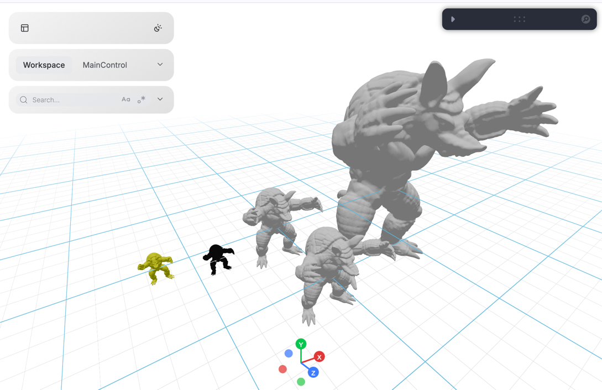

# Loading 3D Meshes

This example demonstrates **4 different ways** to load and display 3D mesh files in Vuer, and how to update the mesh in real-time.



| Method | Component | Use Case |
|--------|-----------|----------|
| URL source | `Obj(src=...)` | Load from static server or CDN |
| Binary buffer | `Obj(buff=...)` | Pre-loaded binary data |
| Text content | `Obj(text=...)` | OBJ file as string |
| TriMesh | `TriMesh(vertices=..., faces=...)` | Direct numpy arrays, real-time updates |

```{admonition} Real-Time Updates
:class: info
The `TriMesh` component is particularly powerful for real-time applications. In the animation loop above, we update the mesh position at ~60fps using `session.update`. 
```

## Code Example

```python
from asyncio import sleep
from pathlib import Path

import numpy as np
import trimesh

from vuer import Vuer
from vuer.events import Set
from vuer.schemas import Obj, DefaultScene, TriMesh, OrbitControls

# First, we load the mesh using trimesh and prepare the data in different formats:

assets_folder = Path(__file__).parent / "../../../../assets"
test_file = "static_3d/armadillo_midres.obj"

# Load mesh with trimesh for vertex/face data
mesh = trimesh.load_mesh(assets_folder / test_file)
assert isinstance(mesh, trimesh.Trimesh)
mesh.apply_scale(0.1)

# Prepare binary and text formats for Obj loader
with open(assets_folder / test_file, "rb") as f:
    data = f.read()  # Binary buffer
    text = trimesh.util.decode_text(data)  # Text content

# Now we create a Vuer app and set up the scene with all 5 loading methods:

app = Vuer(static_root=assets_folder)

print(f"Loaded mesh with {mesh.vertices.shape} vertices and {mesh.faces.shape} faces")

@app.spawn(start=True)
async def main(session):
    session @ Set(
        DefaultScene(
            # Method 1: Load from URL (static server)
            Obj(
                key="src-loader",
                src="http://localhost:8012/static/" + test_file,
                position=[3, 0, 0],
            ),
            # Method 2: Load from binary buffer
            Obj(
                key="buff-loader",
                buff=data,
                position=[1, 0, 0],
                scale=0.3
            ),
            # Method 3: Load from text content
            Obj(
                key="text-loader",
                text=text,
                position=[1, 0, 1],
                scale=0.3,
            ),
            # Method 4: TriMesh with vertices and faces (solid)
            TriMesh(
                key="trimesh",
                vertices=np.array(mesh.vertices),
                faces=np.array(mesh.faces),
                position=[0, 0, 0],
                color="#23aaff",
                materialType="depth",
            ),
            # Method 5: TriMesh wireframe mode
            TriMesh(
                key="wireframe",
                vertices=np.array(mesh.vertices),
                faces=np.array(mesh.faces),
                wireframe=True,
                position=[-0.3, 0, 0],
                color="yellow",
            ),
            # y-up
            show_helper=False,
            up=[0, 1, 0],
            bgChildren=[
                OrbitControls(key="OrbitControls")
            ],
        ),
    )

    # Real-time mesh animation using TriMesh
    # This demonstrates why TriMesh is ideal for dynamic updates
    i = 0
    while True:
        i += 1
        x, z = 0.3 * np.sin(i / 10), 0.3 * np.cos(i / 10)
        session.update @ TriMesh(
            key="trimesh",
            vertices=np.array(mesh.vertices),
            faces=np.array(mesh.faces),
            position=[x, 0, z],
            color="#23aaff",
        )
        await sleep(0.016)
```
