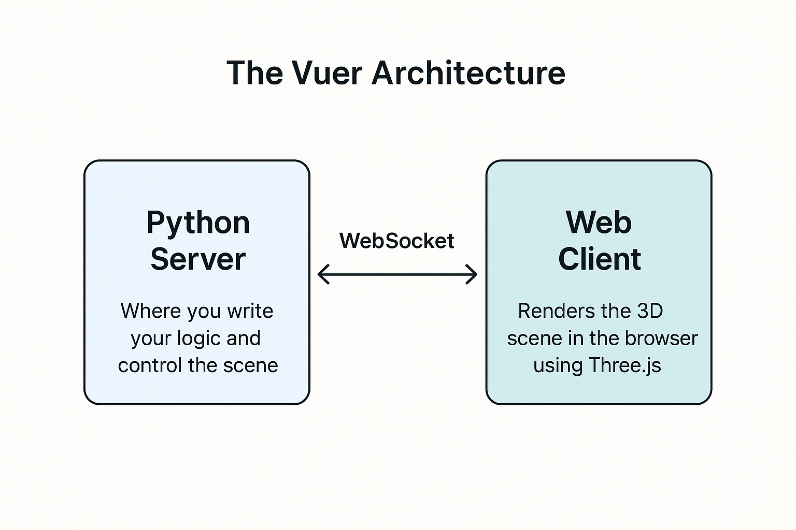

# 3.1.1 Constructing A Scene in Python

## Overview

Vuer uses a client-server architecture where you write Python code to control a 3D scene rendered in the browser. This guide will teach you the fundamentals of creating and managing 3D scenes.

By the end of this tutorial series, you'll be able to create rich 3D scenes like this:

<iframe src="https://vuer.ai/?grid=False&collapseMenu=True&initCamPos=-4%2C2%2C4&reconnect=True&scene=h6N0YWelU2NlbmWja2V5oTCidXCTAAEApGdyaWTCqmJnQ2hpbGRyZW6Qq3Jhd0NoaWxkcmVulYqoY2hpbGRyZW6Qo3RhZ6lTcG90TGlnaHSja2V5qWtleS1saWdodKhwb3NpdGlvbpP7AwWpaW50ZW5zaXR5UKVhbmdsZcs%2F4AAAAAAAAKhwZW51bWJyYcs%2F6ZmZmZmZmqVjb2xvcqcjZmY5ZjVhqmNhc3RTaGFkb3fDoioqg65zaGFkb3ctbWFwU2l6ZZLNCADNCACyc2hhZG93LWNhbWVyYS1uZWFyyz%2FgAAAAAAAAsXNoYWRvdy1jYW1lcmEtZmFyMoqoY2hpbGRyZW6Qo3RhZ6lTcG90TGlnaHSja2V5qXJpbS1saWdodKhwb3NpdGlvbpMEBfqpaW50ZW5zaXR5MqVhbmdsZcs%2F4zMzMzMzM6hwZW51bWJyYcs%2F7mZmZmZmZqVjb2xvcqcjNWFhMGZmqmNhc3RTaGFkb3fDoioqg65zaGFkb3ctbWFwU2l6ZZLNCADNCACyc2hhZG93LWNhbWVyYS1uZWFyyz%2FgAAAAAAAAsXNoYWRvdy1jYW1lcmEtZmFyMoioY2hpbGRyZW6Qo3RhZ61SZWN0QXJlYUxpZ2h0o2tleapmaWxsLWxpZ2h0qHBvc2l0aW9ukwYCBKlpbnRlbnNpdHkIpXdpZHRoBKZoZWlnaHQEpWNvbG9ypyNlOGQ1ZmaFqGNoaWxkcmVukKN0YWesQW1iaWVudExpZ2h0o2tleadhbWJpZW50qWludGVuc2l0ecs%2FwzMzMzMzM6Vjb2xvcqcjNGE1NTY4g6hjaGlsZHJlbpCjdGFnrU9yYml0Q29udHJvbHOja2V5q29yYi1jb250cm9sqGNoaWxkcmVumIioY2hpbGRyZW6Qo3RhZ6hDeWxpbmRlcqNrZXmubWF0dGUtY3lsaW5kZXKkYXJnc5TLP%2BmZmZmZmZrLP%2BmZmZmZmZrLP%2BAAAAAAAAAgqHBvc2l0aW9uk8vADAAAAAAAAMs%2F0AAAAAAAAP%2BsbWF0ZXJpYWxUeXBlqHN0YW5kYXJkqG1hdGVyaWFsg6Vjb2xvcqcjNGEzNDI4qXJvdWdobmVzc8s%2F7rhR64UeuKltZXRhbG5lc3MAqmNhc3RTaGFkb3fDiKhjaGlsZHJlbpCjdGFnplNwaGVyZaNrZXmsbWF0dGUtc3BoZXJlpGFyZ3OTyz%2FmZmZmZmZmICCocG9zaXRpb26Ty8AMAAAAAAAAyz%2FxmZmZmZma%2F6xtYXRlcmlhbFR5cGWoc3RhbmRhcmSobWF0ZXJpYWyDpWNvbG9ypyM2YjRlM2Spcm91Z2huZXNzAaltZXRhbG5lc3MAqmNhc3RTaGFkb3fDiahjaGlsZHJlbpCjdGFnqk9jdGFoZWRyb26ja2V5sGdsYXNzLW9jdGFoZWRyb26kYXJnc5LLP%2BzMzMzMzM0AqHBvc2l0aW9uk8u%2F%2FMzMzMzMzcs%2F%2BAAAAAAAAMs%2F0zMzMzMzM6hyb3RhdGlvbpMAAMs%2F2SbpeNT99KxtYXRlcmlhbFR5cGWocGh5c2ljYWyobWF0ZXJpYWyFpWNvbG9ypyNmZmZmZmasdHJhbnNtaXNzaW9uAal0aGlja25lc3PLP%2BmZmZmZmZqpcm91Z2huZXNzAKNpb3LLP%2FgAAAAAAACqY2FzdFNoYWRvd8OJqGNoaWxkcmVukKN0YWelVG9ydXOja2V5q2dsYXNzLXRvcnVzpGFyZ3OUyz%2FgAAAAAAAAyz%2FDMzMzMzMzIECocG9zaXRpb26TAMs%2F2ZmZmZmZmss%2F6ZmZmZmZmqhyb3RhdGlvbpPLP%2Fki0OVgQYkAAKxtYXRlcmlhbFR5cGWocGh5c2ljYWyobWF0ZXJpYWyFpWNvbG9ypyNkNWU4ZmasdHJhbnNtaXNzaW9uyz%2Ftwo9cKPXDqXRoaWNrbmVzc8s%2F4AAAAAAAAKlyb3VnaG5lc3PLP7R64UeuFHujaW9yyz%2F3MzMzMzMzqmNhc3RTaGFkb3fDiahjaGlsZHJlbpCjdGFno0JveKNrZXmqZ2xvc3N5LWJveKRhcmdzk8s%2F8zMzMzMzM8s%2F8zMzMzMzM8s%2F8zMzMzMzM6hwb3NpdGlvbpPLP9mZmZmZmZrLP%2BAAAAAAAAD%2BqHJvdGF0aW9ukwAAAKxtYXRlcmlhbFR5cGWoc3RhbmRhcmSobWF0ZXJpYWyDpWNvbG9ypyNhMTdjNTCpcm91Z2huZXNzyz%2FUeuFHrhR7qW1ldGFsbmVzc8s%2F6AAAAAAAAKpjYXN0U2hhZG93w4ioY2hpbGRyZW6Qo3RhZ6ZTcGhlcmWja2V5rWdsb3NzeS1zcGhlcmWkYXJnc5PLP%2BTMzMzMzM0gIKhwb3NpdGlvbpPLP%2FzMzMzMzM3LP%2BZmZmZmZmYArG1hdGVyaWFsVHlwZahzdGFuZGFyZKhtYXRlcmlhbIOlY29sb3KnI2I4OTI1Zqlyb3VnaG5lc3PLP7wo9cKPXCmpbWV0YWxuZXNzyz%2FoAAAAAAAAqmNhc3RTaGFkb3fDiahjaGlsZHJlbpCjdGFnpVBsYW5lo2tleaVmbG9vcqRhcmdzkhQUqHBvc2l0aW9ukwAAAKhyb3RhdGlvbpPLv%2FkeuFHrhR8AAKxtYXRlcmlhbFR5cGWoc3RhbmRhcmSobWF0ZXJpYWyCo21hcNlNaHR0cHM6Ly9yYXcuZ2l0aHVidXNlcmNvbnRlbnQuY29tL3Z1ZXItYWkvdnVlci9tYWluL2RvY3MvX3N0YXRpYy8wM19mbG9vci5qcGepcm91Z2huZXNzyz%2FszMzMzMzNrXJlY2VpdmVTaGFkb3fDiKhjaGlsZHJlbpCjdGFnpVBsYW5lo2tleahiYWNrZHJvcKRhcmdzkhQUqHBvc2l0aW9ukwAA%2FaxtYXRlcmlhbFR5cGWoc3RhbmRhcmSobWF0ZXJpYWyCo21hcNlQaHR0cHM6Ly9yYXcuZ2l0aHVidXNlcmNvbnRlbnQuY29tL3Z1ZXItYWkvdnVlci9tYWluL2RvY3MvX3N0YXRpYy8wM19iYWNrZHJvcC5qcGepcm91Z2huZXNzyz%2FuZmZmZmZmrXJlY2VpdmVTaGFkb3fD" width="100%" height="400px" frameborder="0"></iframe>

*Expected scene: a complete scene with diverse geometry, materials, textures, and dramatic lighting*

But we'll start simple. In this document, you'll learn to build your first basic scene:

<iframe src="https://vuer.ai/?grid=False&collapseMenu=True&initCamPos=-4%2C2%2C4&reconnect=True&scene=hqN0YWelU2NlbmWja2V5oTCidXCTywAAAAAAAAAAyz%2FwAAAAAAAAywAAAAAAAAAApGdyaWTCq3Jhd0NoaWxkcmVukoSoY2hpbGRyZW6Qo3RhZ6xBbWJpZW50TGlnaHSja2V5p2FtYmllbnSpaW50ZW5zaXR5yz%2FgAAAAAAAAhahjaGlsZHJlbpCjdGFnsERpcmVjdGlvbmFsTGlnaHSja2V5o3N1bqlpbnRlbnNpdHnLP%2FAAAAAAAACocG9zaXRpb26Ty0AIAAAAAAAAy0AIAAAAAAAAy0AIAAAAAAAAqGNoaWxkcmVukYeoY2hpbGRyZW6Qo3RhZ6NCb3ija2V5qnNpbXBsZS1ib3ikYXJnc5PLP%2FMzMzMzMzPLP%2FMzMzMzMzPLP%2FMzMzMzMzOocG9zaXRpb26Tyz%2FZmZmZmZmayz%2FgAAAAAAAAy8AAAAAAAAAAqHJvdGF0aW9uk8sAAAAAAAAAAMs%2F0zMzMzMzM8sAAAAAAAAAAKxtYXRlcmlhbFR5cGWlYmFzaWM%3D" width="100%" height="400px" frameborder="0"></iframe>

*Starting point: a simple box on a dark stage*

## How Vuer Works



Vuer uses a **client-server architecture**:

- **Python Server**: Where you write your logic and control the scene
- **Web Client**: Renders the 3D scene in the browser using Three.js
- **WebSocket**: Real-time bidirectional communication

Each browser connection creates an independent **session**, allowing multiple users to view different scenes simultaneously.

## Creating Your First Scene

Here's a complete example that creates a simple scene with a golden box:

```python
from vuer import Vuer, VuerSession
from vuer.schemas import Scene, Box, AmbientLight, DirectionalLight, OrbitControls

app = Vuer()

@app.spawn(start=True)
async def main(session: VuerSession):
    # Create a simple starting scene
    session.set @ Scene(
        # Center piece: simple golden box
        Box(
            args=[1.2, 1.2, 1.2],           # width, height, depth
            position=[0.4, 0.5, -2],          # x, y, z position
            rotation=[0, 0.3, 0],
            materialType="basic",         # Standard material
            key="simple-box",
        ),
        # Coordinate system: y-up (default)
        up=[0, 1, 0],
        grid=False,
        rawChildren=[
            AmbientLight(key="ambient", intensity=0.3),
            DirectionalLight(key="sun", intensity=1, position=[5, 5, 5]),
            OrbitControls(key="controls"),
        ],
    )

    # Keep the session alive
    await session.forever()
```

**Understanding the Code:**

- `app = Vuer()`: Creates the server instance
- `@app.spawn(start=True)`: Binds the function to handle client connections and starts the server
- `session.set @ Scene(...)`: Initializes the 3D scene for this client
- `Box(...)`: Creates a 3D box with position, rotation, and material
- `rawChildren=[...]`: Contains lights and controls (not rendered as 3D objects)
  - `AmbientLight`: Soft overall illumination
  - `DirectionalLight`: Sunlight-like directional lighting
  - `OrbitControls`: **Essential for camera control** (rotate, pan, zoom)
- `await session.forever()`: Keeps the connection alive

Run the script and you'll see the simple box scene shown at the beginning:

```shell
Visit: https://vuer.ai?ws=ws://localhost:8012
```

## Next Steps

Now that you can create basic scenes, learn about:
- [The Magical Index of Vuer Components](./02_component_index.md) - All available 3D objects
- [Materials and Textures](03_materials_and_textures.md) - Making objects look good
- [Camera Control](./04_camera_control.md) - Viewing your scene
- [Lights](./05_lights.md) - Illuminating your world
