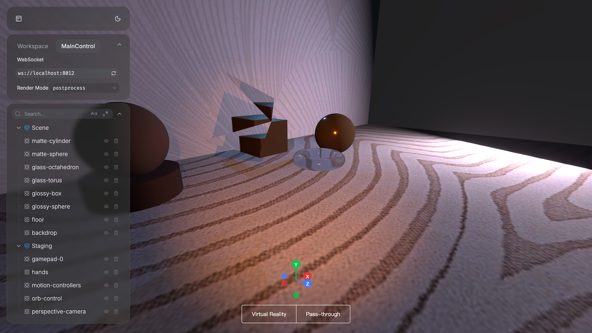

# 5. Render Modes

Vuer supports multiple render modes that control how your 3D scene is rendered, from standard real-time rendering to photorealistic path tracing. Each mode serves different purposes and offers unique visual characteristics.

- **[Post-processing](05_render_modes/post_processing.md)** - Add bloom effects and visual polish with screen-space post-processing
- **[Path Tracing Renders](05_render_modes/path_tracing.md)** - Create photorealistic renders with accurate global illumination

## Visual Comparison

Here's the same scene rendered with different modes to illustrate their visual characteristics:

| RGB (Default) | Post-process | Path Tracing |
|---------------|--------------|--------------|
|  |  |  |
| Standard real-time rendering | Adds bloom effects for visual polish | Photorealistic with accurate lighting |

## Available Render Modes

Vuer provides five distinct render modes that can be toggled through the web interface:

- **RGB** (default): Standard real-time rendering without post-processing. Best for interactive experiences and maximum performance.
- **Post-process**: Applies post-processing effects like bloom to add visual polish through screen-space effects.
- **Depth**: Visualizes scene depth, useful for debugging camera setups and understanding spatial relationships.
- **Normal**: Shows surface normals, helpful for debugging geometry and lighting issues.
- **Path tracer**: Photorealistic rendering with accurate global illumination, suitable for final renders and presentations.

## Accessing Render Modes

The render mode can be controlled through the UI panel in the Vuer web interface:

1. Open your scene in a browser
2. Click on the **MainControl** tab in the left panel
3. Find the **RenderRoot** section
4. Select "Render Mode" from the dropdown menu
5. Choose from: `rgb`, `postprocess`, `depth`, `normal`, or `pathtracer`

The scene will update in real-time as you switch between modes.

## Related Tutorials

- [Materials and Textures](02_materials_and_textures.md) - Materials affect how different render modes display your scene
- [Lighting](04_lights.md) - Lighting setup is crucial for both post-processing and path tracing
