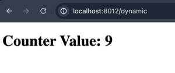

# Adding Dynamic HTML Handler

you can serve dynamic content in the vuer server by adding the following:

```python
from vuer import Vuer

app = Vuer()

counter = 0

def dynamic_html_handler():
    global counter

    counter += 1
    template = f"""
    <!DOCTYPE html>
    <html>
    <head><title>Dynamic HTML</title></head>
    <body>
        <h1>Counter Value: {counter}</h1>
    </body>
    </html>
    """
    return template

app.add_route("/dynamic", dynamic_html_handler, method="GET")

# do other stuff...
pass

# now run the server
app.run()
```

Now, if you visit the path [http://localhost:8012/dynamic](http://localhost:8012/dynamic)
you shall see the counter updates upon each refresh.


