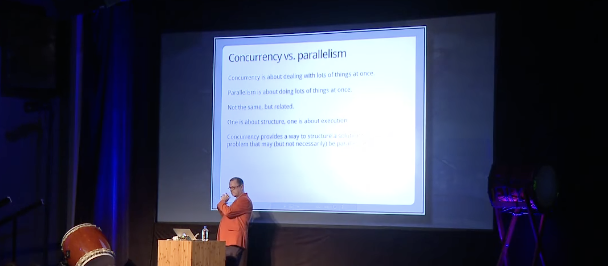

# Introduction to Async Python

Modern web applications in javascript runs in a single thread, but they are
able to concurrently handle a number of user interactions. This is enabled by
the [async/await](https://realpython.com/python-async-io/#async-await) syntax
that yields control to the [event loop](https://realpython.com/python-async-io/#event-loop).
We chose async Python for `vuer` to enable highly-performant, *two-way*
event-driven communication between the frontend and Python server. In contrast,
`viser` uses a synchronous API that hides communication implicitly, which can
cause freezing when rendering many geometries. Async patterns let you explicitly
handle concurrency in a cooperative manner for better performance.

```{admonition} Read This First
:class: important

### What is Concurrency?

On the difference between concurrency and parallelism (and how
concurrency is different from parallelism), watch [this
video by Rob Pike](https://youtu.be/oV9rvDllKEg), the creator
of the programming language, `Go`.

[](https://youtu.be/oV9rvDllKEg)
```

The downside, however, is that async python will be a little different from
what you are used to, so we prepared this short tutorial to teach you the
basics. For a canonical introduction to async programming,
see [async-io documentation](https://realpython.com/async-io-python/).

## Understanding The Event Loop

The **event loop** is the heart of async programming. Here's how it works:

```python
# Simplified event loop pseudo-code
while True:
    for task in tasks:
        if task.is_ready():
            task.run_until_await()  # Run until `await`, then switch to next task
```

Here's a simple example showing two tasks running concurrently:

```python
import asyncio


async def task_a():
    print("A: start")
    await asyncio.sleep(0.5)
    print("A: done")


async def task_b():
    print("B: start")
    await asyncio.sleep(0.3)
    print("B: done")


async def main():
    await asyncio.gather(task_a(), task_b())


asyncio.run(main())
```

**Output:**

```
A: start
B: start
B: done    # Finishes first (0.3s)
A: done    # Finishes second (0.5s)
```

**What the event loop does:**

1. Starts `task_a()` → prints "A: start" → hits `await sleep(0.5)` → pauses
2. Starts `task_b()` → prints "B: start" → hits `await sleep(0.3)` → pauses
3. After 0.3s: resumes `task_b()` → prints "B: done"
4. After 0.5s: resumes `task_a()` → prints "A: done"

Both tasks run concurrently, interleaving their execution through the event loop.

## Canceling Tasks

**Use `task.cancel()` to stop long-running tasks:**

```python
import asyncio


async def long_task():
    for i in range(100):
        print(f"Tick {i}")
        await asyncio.sleep(1)


async def main():
    task = asyncio.create_task(long_task())
    await asyncio.sleep(2.5)  # Let it run briefly
    task.cancel()  # Stop it


asyncio.run(main())
```

**Output:**

```
Tick 0
Tick 1
Tick 2
```

## Async in Vuer

In Vuer, use `sess.spawn_task()` just like `asyncio.create_task()`:

```python
from asyncio import sleep
from vuer import Vuer, VuerSession

app = Vuer()


async def background_counter():
    """Runs independently, counting in the background"""
    for i in range(5):
        print(f"Background: {i}")
        await sleep(1)


@app.spawn(start=True)
async def main(sess: VuerSession):
    # Start a background task
    task = sess.spawn_task(background_counter())

    # Main loop continues independently
    for i in range(3):
        print(f"Main: {i}")
        await sleep(0.5)

    # Wait for background task to finish
    await task
    print("Done!")
```

**Output:**

```
Main: 0
Background: 0
Main: 1
Main: 2
Background: 1
Background: 2
Background: 3
Background: 4
Done!
```

This pattern lets you handle user interactions, sensors,
and animations concurrently in Vuer.

Now you know the basics of async programming in Vuer, let's 
move on to setting up your first 3D scene!
