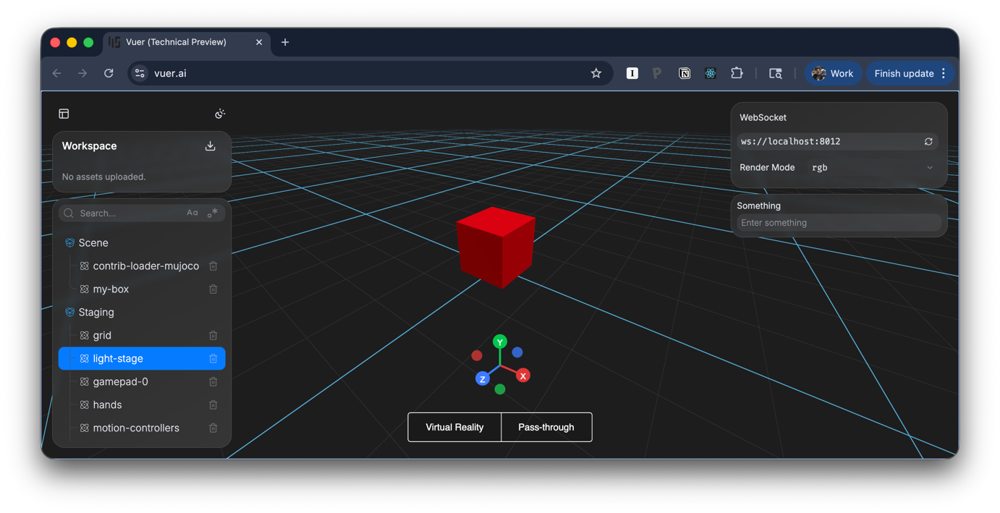
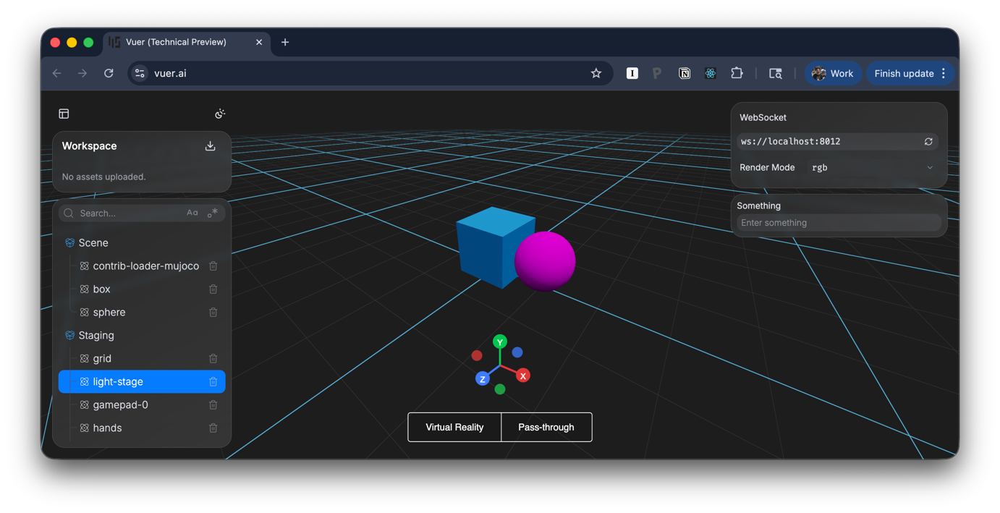

# Setting Up Your First Scene

Create a simple 3D scene with a red box.

## Minimal Example

```python
from vuer import Vuer, VuerSession
from vuer.schemas import Box

app = Vuer()

@app.spawn
async def main(session: VuerSession):
  session.upsert @ Box(
    args=[0.2, 0.2, 0.2],  # width, height, depth in meters
    position=[0, 0.1, 0],
    material={'color': "red"},
    key="my-box",
  )
  await session.forever()

main.start()
```



## Key Concepts

- **`@app.spawn`** - Binds the function to run when a client connects, returns a SpawnHandle.
- **`main.start()`** - SpawnHandle.start starts the server. 
- **`session.upsert @ Box(...)`** - Sends objects to the client (the `@` operator)
- **`key="my-box"`** - Every component needs a unique key
- **`await session.forever()`** - Keeps the session alive

## Adding More Objects

Add multiple objects with multiple `upsert` calls:

```python
from vuer import Vuer, VuerSession
from vuer.schemas import Box, Sphere

app = Vuer()


@app.spawn()
async def main(sess: VuerSession):
  sess.upsert @ Box(
    args=[0.2, 0.2, 0.2], position=[0, 0.1, 0], material={"color": "#23aaff"}, key="box"
  )  # noqa

  sess.upsert @ Sphere(
    args=[0.1, 9, 9], position=[0.2, 0.1, 0], material={"color": "magenta"}, key="ball"
  )  # noqa
  await sess.forever()


main.start()

```

