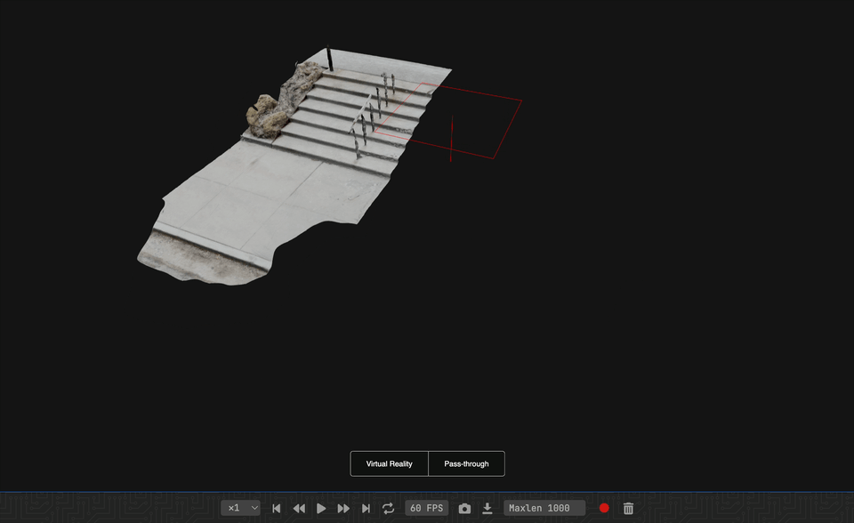

# An Simple Example of Component Life Cycle

This tutorial shows the basic life cycle (C~R~UD) of a component.
- [ ] adding a component
- [ ] updating in-place
- [ ] remove



```python
from asyncio import sleep
from pathlib import Path

from vuer import Vuer
from vuer.schemas import Obj, DefaultScene

assets_folder = Path(__file__).parent.parent.parent / "_static" / "stairway"
test_file = "textured.obj"
test_mtl = "textured.mtl"

app = Vuer(static_root=assets_folder)

# use `start=True` to start the app immediately
@app.spawn(start=True)
async def main(session):
    session.set @ DefaultScene(grid=False)

    wireframe = False

    while True:
        session.upsert @ Obj(
            key="src-loader",
            src="http://localhost:8012/static/" + test_file,
            mtl="http://localhost:8012/static/" + test_mtl,
            position=[0, 0, 0],
            wireframe=wireframe,
        )

        wireframe = not wireframe

        await sleep(0.01)

        session.upsert @ Obj(
            key="src-loader-wireframe",
            src="http://localhost:8012/static/" + test_file,
            mtl="http://localhost:8012/static/" + test_mtl,
            position=[0, 0, 5],
            color="red",
            wireframe=True,
        )

        await sleep(0.8)

        session.remove @ "src-loader-wireframe"
```
