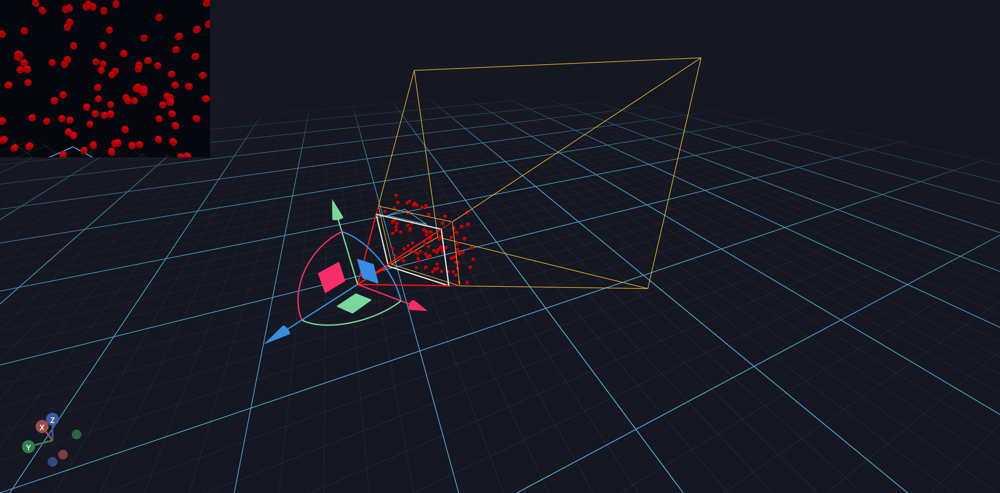

# Transforming Points Using Camera Matrix



This tutorial shows how to transform points from camera space to world space using
the camera's transformation matrix. This is useful when you need to:
- Place objects relative to the camera's view
- Visualize the camera frustum with sample points
- Project points between coordinate systems

This tutorial will teach you how to:
- Sample random points within a camera frustum
- Transform points using homogeneous coordinates
- Update scene objects in response to camera movement


## Step 1: Define Frustum Sampling Function

First, we create a helper function to sample random points within the camera frustum.
The frustum is the visible volume between the near and far clipping planes.

```
        near plane    far plane
           │             │
     ┌─────┼─────┐ ┌─────┼─────┐
     │  ·  │  ·  │ │  ·  │  ·  │
     │  ·  │  ·  │ │  ·  │  ·  │
     └─────┼─────┘ └─────┼─────┘
           │             │
        camera ─────────────────▶ Z (backward)
```

Points are sampled in view space where X is right, Y is up, and Z points backward.

```python
from typing import Tuple
import numpy as np

def sample_camera_frustum_batch(
    fov: float,
    width: float,
    height: float,
    near: float,
    far: float,
    num_samples=1,
    **_,
) -> Tuple[np.ndarray]:
    """Sample Camera Frustum

    For rectangular cameras, sample a point between near and far plane, relative to camera transform

    Output in view space: X right, Y up, Z backward

    (Assumed to have the same intrinsics for each sample)


    :param fov: vertical field-of-view, in degrees
    :param width: px
    :param height: px
    :param near: in meters (world units)
    :param far: in meters (world units)
    """
    aspect = width / height
    fov_rad = fov * np.pi / 180
    foh_rad = np.arctan(np.tan(fov_rad / 2) * aspect) * 2

    d = np.random.uniform(near, far, size=num_samples)  # distance in camera coordinates

    y_range = d * np.tan(fov_rad / 2)
    y = np.random.uniform(-y_range, y_range, size=num_samples)

    x_range = d * np.tan(foh_rad / 2)
    x = np.random.uniform(-x_range, x_range, size=num_samples)

    return np.stack([x, y, -d]).T
```

## Step 2: Define Point Transformation Function

To transform points from camera space to world space, we use the camera's 4x4
transformation matrix. We convert 3D points to homogeneous coordinates (adding a
fourth component of 1), multiply by the matrix, and extract the 3D result.

```python
def transform_points(pts, matrix):
    """Transform 3D points using a 4x4 transformation matrix.

    Args:
        pts: Array of shape (N, 3) containing 3D points
        matrix: 4x4 transformation matrix

    Returns:
        Transformed points as array of shape (N, 3)
    """
    # Add homogeneous coordinate (w=1) to each point
    pts_homogeneous = np.hstack((pts, np.ones((len(pts), 1))))

    # Apply the transformation matrix
    transformed_pts = pts_homogeneous @ matrix

    # Extract 3D coordinates (drop the w component)
    return transformed_pts[:, :3]
```

## Step 3: Set Up the Scene and Camera Movement Handler

We create a scene with a movable `CameraView` and register a handler to track
when the camera is moved. When the camera matrix changes, we'll update the
positions of the sample points.

```python
import asyncio

from vuer import Vuer, VuerSession
from vuer.events import ClientEvent
from vuer.schemas import DefaultScene, CameraView, Sphere, OrbitControls

# Sample 100 random points within the camera frustum
ball_pts = sample_camera_frustum_batch(
    fov=50,
    width=320,
    height=240,
    near=0.45,
    far=0.5,
    num_samples=100,
)

app = Vuer()

# Initial camera transformation matrix (4x4, column-major format)
# fmt: off
matrix = np.array([
    -0.9403771820302098, -0.33677144289058686, 0.04770482963301034, 0,
    0.14212405695663877, -0.26162828559882034, 0.9546472608292598, 0,
    -0.30901700268934784, 0.9045085048953463, 0.2938925936815643, 0,
    -0.47444114213044175, 1.2453493553603068, 0.5411873913841395, 1,
]).reshape(4, 4)
# fmt: on

@app.add_handler("CAMERA_MOVE")
async def track_camera_movement(event: ClientEvent, sess: VuerSession):
    """Update the global matrix when the camera is moved."""
    global matrix

    # Only respond to the "ego" camera
    if event.key != "ego":
        return
    if event.value["matrix"] is None:
        return

    new_matrix = np.array(event.value["matrix"]).reshape(4, 4)
    if not np.allclose(new_matrix, matrix):
        print("Camera matrix changed")
        matrix = new_matrix

@app.spawn(start=True)
async def main(proxy):
    # Set up the scene with a movable camera
    proxy.set @ DefaultScene(
        rawChildren=[
            CameraView(
                fov=50,
                width=320,
                height=240,
                key="ego",
                matrix=matrix.flatten().tolist(),
                stream="ondemand",
                fps=30,
                near=0.4,
                far=1.8,
                showFrustum=True,
                downsample=1,
                distanceToCamera=2,
            ),
        ],
        grid=False,
        bgChildren=[
            OrbitControls(key="OrbitControls")
        ],
    )

    last_matrix_id = None
    while True:
        # Only update when the matrix changes
        if last_matrix_id and id(matrix) == last_matrix_id:
            await asyncio.sleep(0.016)
            continue

        last_matrix_id = id(matrix)

        # Transform sample points from camera space to world space
        world_pts = transform_points(ball_pts, matrix)
        print("Updating ball positions")

        # Create spheres at the transformed positions
        proxy.upsert @ [
            Sphere(
                args=[0.01],
                position=world_pts[i].tolist(),
                material=dict(color="red"),
                materialType="phong",
                key=f"ball-{i}",
            )
            for i in range(len(ball_pts))
        ]

        await asyncio.sleep(0.01)
```
