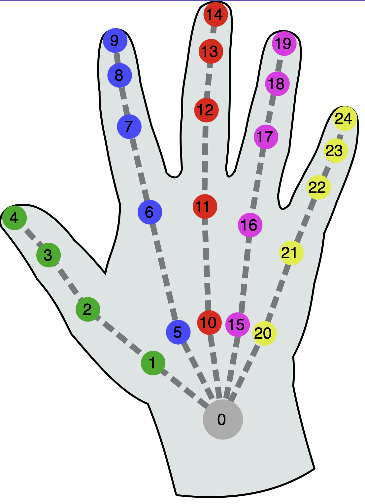
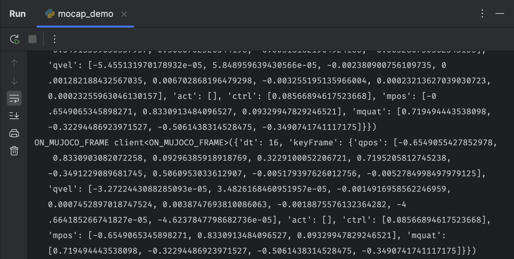

# MuJoCo VR Mocap Hand Example

The mocap hand points offer a way to mimic users hand pose with MuJoCo mocap points, 
allowing for control over virtual hands in a MuJoCo environment.

```{admonition} Warning
:class: warning
Please go through the relevant documentation of either ngrok
or localtunnel before preceding.
- **ngrok documentation:** [https://ngrok.com/docs](https://ngrok.com/docs)
- **local tunnel documentation:** [https://localtunnel.me](https://localtunnel.me)
```

## Mocap Point API

By default any mocap body specified in the MuJoCo XML file will become a movable mocap point in the VR environment.
In order to control specific mocap points with hand joints, we follow XR Hand Naming Conventions, where any mocap body with
the same naming convention will be linked to that joint:

"{joint}-{left | right}" where joint is the name of the joint and left or right specifies the side of the hand.



| Hand joint                        | Index |  Hand joint (continue)           | Index |
|---------------------------------  |-------| ---------------------------------|-------|
| wrist                             | 0     | middle-finger-phalanx-distal    | 13    | 
| thumb-metacarpal                  | 1     | middle-finger-tip               | 14    | 
| thumb-phalanx-proximal            | 2     | ring-finger-metacarpal          | 15    | 
| thumb-phalanx-distal              | 3     | ring-finger-phalanx-proximal    | 16    | 
| thumb-tip                         | 4     | ring-finger-phalanx-intermediate | 17   | 
| index-finger-metacarpal           | 5     | ring-finger-phalanx-distal      | 18    | 
| index-finger-phalanx-proximal     | 6     | ring-finger-tip                 | 19    | 
| index-finger-phalanx-intermediate | 7     | pinky-finger-metacarpal         | 20    | 
| index-finger-phalanx-distal       | 8     | pinky-finger-phalanx-proximal   | 21    | 
| index-finger-tip                  | 9     | pinky-finger-phalanx-intermediate | 22  | 
| middle-finger-metacarpal          | 10    | pinky-finger-phalanx-distal     | 23    | 
| middle-finger-phalanx-proximal    | 11    | pinky-finger-tip                | 24    | 
| middle-finger-phalanx-intermediate | 12   | -                               | -     | 


```python
'<body mocap="true" name="middle-finger-phalanx-proximal-right" pos="0.347 -0.012 1.01" quat="0 -0.7071 -0.7071 0">'
```


Now, to get the mujoco updates, we can listen to the `ON_MUJOCO_FRAME` event.

```python
@app.add_handler("ON_MUJOCO_FRAME")
async def on_mujoco_frame(event: ClientEvent, sess: VuerSession):
    print("ON_MUJOCO_FRAME", event)
```

You should get events that looks like these:



and the main session handler.

```python
@app.spawn(start=True)
async def main(sess: VuerSession):
    # here we setup the staging area. Use Fog to simulate MuJoCo's
    # default style.
    sess.set @ Scene(
        # grid=False,
        bgChildren=[
            Fog(color=0x2C3F57, near=10, far=20),
            Hands(),
            Sphere(
                args=[50, 10, 10],
                materialType="basic",
                material=dict(color=0x2C3F57, side=1),
            ),
        ],
    )
    await sleep(0.0005)
    sess.upsert @ MuJoCo(

        HandActuator(key="pinch-on-squeeze"),
        key="franka-gripper",
        src=asset_pref + "scene.xml",
        assets=[asset_pref + fn for fn in ASSETS_LIST],
        useLights=True,
        timeout=1000000,
        scale=0.1,
    )

    await sleep(100.0)
```
