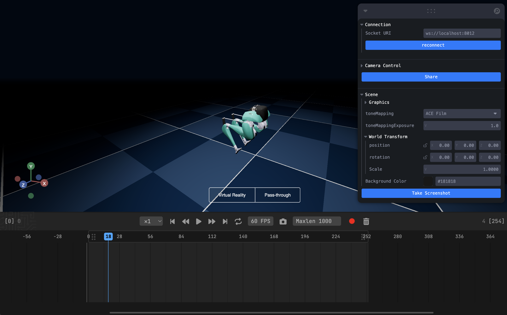

# MuJoCo Component

This component allows you to run the MuJoCo simulations in the browser.



You need to supply a list of path to relevant files to the `assets` attribute.

```python
from vuer import Vuer, VuerSession
from vuer.schemas import MuJoCo, Scene, Fog, Sphere, ContribLoader

app = Vuer(static_root="./assets")

asset_pref = "http://localhost:8012/static/agility_cassie/"


@app.spawn(start=True)
async def main(sess: VuerSession):
    # here we setup the staging area. Use Fog to simulate MuJoCo's
    # default style.
    sess.set @ Scene(
        ContribLoader(
            library="@vuer-ai/mujoco-ts",
            version="0.0.24-rc13",
            main="dist/index.umd.js",
        ),
        bgChildren=[
            Fog(color=0x2c3f57, near=10, far=20),
            Sphere(
                args=[50, 10, 10],
                materialType="basic",
                material=dict(color=0x2c3f57, side=1),
            ),
        ],
    )
    # you need to wait long enough for the script to load, unless you
    # listen to and wait for the `ON_CONTRIB_LOAD` event.
    await sleep(1.)
    sess.upsert @ MuJoCo(
        key="cassie-1",
        src=asset_pref + "scene.xml",
        assets=[
            asset_pref + "assets/achilles-rod.obj",
            asset_pref + "assets/cassie-texture.png",
            asset_pref + "assets/foot-crank.obj",
            asset_pref + "assets/foot.obj",
            asset_pref + "assets/heel-spring.obj",
            asset_pref + "assets/hip-pitch.obj",
            asset_pref + "assets/hip-roll.obj",
            asset_pref + "assets/hip-yaw.obj",
            asset_pref + "assets/knee-spring.obj",
            asset_pref + "assets/knee.obj",
            asset_pref + "assets/pelvis.obj",
            asset_pref + "assets/plantar-rod.obj",
            asset_pref + "assets/shin.obj",
            asset_pref + "assets/tarsus.obj",
            asset_pref + "cassie.xml",
            asset_pref + "scene.xml",
        ],
        useLights=True,
    )

    await sleep(100.0)

    # # fmt: off
    # await save_doc()
```
